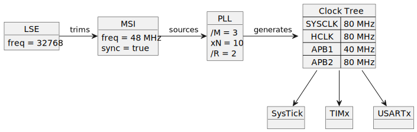
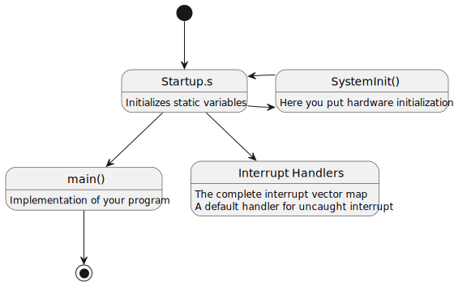

# <big>General Concepts</big>

# Template Library Concepts

Since the library is template based development concept is quite 
different than a regular C program: Your firmware specification has to be 
translated to data-types, which in most cases are internally translated 
to raw constants known to the compiler.

By calling `Init()` or `Setup()` a minimal set of instructions are used 
to apply your model (i.e. specification) into the hardware registers.
This approach has the advantage that you are working with data-models 
in a more abstract way. And the template definition follows the hierarchy 
of your hardware.


## Template Data Models, an Example

For example, in the STM32L432KC, the MSI clock may benefit of the LSE 
clock to produce an accurate frequency, correcting the RC frequency (MSI) 
with the LSE frequency (a tiny and cheap 32768 XTAL). And this MSI clock 
can be used as input to the PLL to generate the system clock at very high 
frequencies.

This makes a dependency implemented on hardware: The Clock Tree depend on 
the PLL, which depends on MSI, which depends on LSE.

For a USB application using a STML432KC one could setup the clock in the 
following form:



<div hidden>
```
@startuml clock_tree
object LSE
LSE : freq = 32768
object MSI
MSI : freq = 48 MHz
MSI : sync = true
object PLL
PLL : /M = 3
PLL : xN = 10
PLL : /R = 2
object SYSCLK
SYSCLK : freq = 80 MHz
LSE -> MSI :  trims
MSI -> PLL : sources
PLL -> SYSCLK : generates
@enduml
```
</div>

> In this application, a 48 MHz clock is produced for the USB hardware, 
> using the 48 MHz preset of the MSI clock. Since USB requires an 
> accurate clock, not provided by the MSI circuit, an internal LSE 
> synchronization feature is enabled to use the stability of the 32768 
> crystal, tied to the LSE.  
> The MCU in the other hand tops frequency at 80 MHz. The PLL takes care 
> of applying a 5:3 ratio to this frequency to fullfil this requirement. 

Now on the **bmt** perspective, a similar dependency will be represented 
using template data-types like below: 

```cpp
// A data-type for the 48 MHz MSI clock
typedef Clocks::AnyMsi<
    Clocks::MsiFreq::k48_MHz    // Change STM32L432KC internal oscillator from 4 MHz 
                                // to 48MHz (good for USB)
    , true                      // Nucleo32 has an 32768 LSE Xtal that we will use 
                                // for accurate MSI frequency
	> Msi;
// Configure the PLL for 80 MHz
typedef Clocks::AnyPll<
	Msi								// link to 48MHz MSI clock
	, 80000000UL					// Max is 80 MHz
	, Clocks::AutoRange1			// Full voltage range calculator
	> Pll;
// A data-type for the clock tree
typedef Clocks::AnySycClk <
	Pll,							// uses PLL for the clock tree
	Power::Mode::kRange1			// Full Voltage for Max performance
	> SysClk;

extern "C" void SystemInit()
{
	// Reset clock system before starting program
	System::Init();

	// ... initialize other stuff ...

	// Start the 80 MHz clock
	SysClk::Init();

	// ... more stuff to initialize...
}
```

> Note that on the example LSE data-type does not need to be declared, 
> since this is the single possibility available when setting the flag to 
> '`true`' and the library will embed the LSE instance.

Note that a single call to `SysClk::Init()` will apply your clock setup 
according to your data model.


<div hidden>
```
@startuml init_call
[*] -> LSE
LSE : Starts the LSE clock and waits until stable
LSE -> MSI
MSI -> PLL
PLL -> SYSCLK
SYSCLK -> [*]
@enduml
```
</div>

And another interesting advantage: If your firmware contains two 
different performance setup, say for example a full speed and a low power 
model, you can define a second data-type model for your clock setup and 
apply them individually whenever required.

Another interesting advantage of this approach occurs when you change 
specifications (and specs always change in the modern world), you just 
enter a new value and the changes propagates following the data-type 
links.

For example, lets say you decide to operate the MSI clock at 8 MHz 
instead of the 48Mhz shown in the example, just change the value on 
the first definition and changes will propagate:

```cpp
// A data-type for the 8 MHz MSI clock
typedef Clocks::AnyMsi<
    Clocks::MsiFreq::k8_MHz     // Change STM32L432KC internal oscillator from 4MHz 
                                // to 8MHz
    , true                      // Nucleo32 has an 32768 LSE Xtal that we will use 
                                // for accurate MSI frequency
> Msi;

// ... propagates to dependants ...
```

> What is important here, the PLL M, N and R factors are automatically 
> updated to cope with new input clock.

If you don't want to use the PLL and use MSI directly as source clock for 
your clock tree, the change would be as simple as:

```cpp
// ...

// A data-type for the clock tree
typedef Clocks::AnySycClk <
	Msi,							// uses MSI for the clock tree
	Power::Mode::kRange1			// Full Voltage for Max performance
> SysClk;

// ...
```


# The C++ `constexpr` modifier

It features modern C++ language features that allows one to produce a 
very compact code. The library benefits from the `constexpr` keyword 
introduced in later C++ compilers, which perfectly fits bare metal 
development, since most of the interface code handles absolute addresses, 
typically hardware registers.

The `constexpr` modifier instructs the compiler that elements are 
constants, also expressions and logic decisions can be optimized out at 
compile time. Think of it as a complete *C++ interpreter* build into the 
C++ compiler. Everything that can be solved by the *interpreter* happens 
on the compilation phase and the remainder is the code that has to be 
solved at *runtime*.

At the end, most functions, even looking more complex than the C variant, 
ends up with compact code, surpassing any of the available C libraries. 
The final result reduces to straight and simple hardware registers 
writes. 

A brilliant example is the `Clocks::AnyPllVco<>` template class (have a 
look into `clocks.h` file). Using this template class one is able to 
use a brute force algorithm to detect the PLL configuration that best 
approximates a desired output frequency.

> This brute-force method seems to be an overkill in a simple PLL like 
> the one featured in the STM32F103, but if you look into the data-sheet 
> of more modern parts you will surely need a complex solution to 
> configure it.

The compiler produces a single static record of the `PllFraction` 
structure, which is bound to a *weak symbol* which means all instances 
produced during each single translation unit (i.e. each single `.cpp` 
file is compiled independently), is merged into a single record in the 
linking phase and discarded if not referenced.  
Note that reference to the constants within this structure are solved at 
compile time as *literal constants* and will not necessarily cause a 
reference in the binary code. In other words, most of the time the static 
instances that are created, will probably be discarded by the linker.


## Debug Hint: How to inspect the result of PllFraction

Working with those `constexpr` automated algorithms may add complexity 
when developing a new firmware, as it really contains a taste of 
*black magic*. 

So a simple solution is shown on the following code snippet:

```cpp
namespace Bmt
{

extern "C" const Clocks::PllFraction *g_Test;

void Test()
{
    using namespace Bmt::Clocks;
    typedef AnyHse<> HSE;
    typedef PllVcoAuto<> Calculator;	// STM32L432 only
    typedef AnyPll<HSE, 11500000UL, Calculator> PLL;
    PLL::Init();
    // This adds a reference that linker cannot discard the 
    // resulting PllFraction record
    g_Test = &PLL::kPllFraction_;
}

} // namespace Bmt
```

When executing the application call the function and follow the contents 
of `g_Test` variable using the debugger. 

Alternatively, compiling the code with assembler output activated, open 
the Assembler output search for the `PllFraction` substring (compiler 
the structure a very long mangled symbol name having the referred 
structure as part of this label).

In my example case, this is what I found on my assembly file:
```
    .weak   _ZN3Bmt6Clocks6AnyPllINS0_6AnyHseILm8000000ELb0ELb1EEELm11500000ENS0_10PllVcoAutoILNS_5Power4ModeE0EEELb1ELm0ELm0ELm5EE13kPllFraction_E
    .section .rodata._ZN3Bmt6Clocks6AnyPllINS0_6AnyHseILm8000000ELb0ELb1EEELm11500000ENS0_10PllVcoAutoILNS_5Power4ModeE0EEELb1ELm0ELm0ELm5EE13kPllFraction_E,"aG",%progbits,_ZN3Bmt6Clocks6AnyPllINS0_6AnyHseILm8000000ELb0ELb1EEELm11500000ENS0_10PllVcoAutoILNS_5Power4ModeE0EEELb1ELm0ELm0ELm5EE13kPllFraction_E,comdat
    .align 2
    .type   _ZN3Bmt6Clocks6AnyPllINS0_6AnyHseILm8000000ELb0ELb1EEELm11500000ENS0_10PllVcoAutoILNS_5Power4ModeE0EEELb1ELm0ELm0ELm5EE13kPllFraction_E, %object
    .size   _ZN3Bmt6Clocks6AnyPllINS0_6AnyHseILm8000000ELb0ELb1EEELm11500000ENS0_10PllVcoAutoILNS_5Power4ModeE0EEELb1ELm0ELm0ELm5EE13kPllFraction_E, 32
_ZN3Bmt6Clocks6AnyPllINS0_6AnyHseILm8000000ELb0ELb1EEELm11500000ENS0_10PllVcoAutoILNS_5Power4ModeE0EEELb1ELm0ELm0ELm5EE13kPllFraction_E:
    .word   8000000
    .word   92000000
    .word   8000000
    .word   96000000
    .word   12
    .word   1
    .word   8
    .word   4
```

Putting data into a nice table (see data-sheet for terms):

| Field  | Value    | Description                                        |
|--------|----------|----------------------------------------------------|
| `clk`  | 8000000  | Clock value sourcing the PLL (obtained from `HSE`) |
| `fq`   | 92000000 | Desired PLL frequency (`92 MHz / 8 = 11.5 MHz`)    |
| `fin`  | 8000000  | PLL input frequency (after applying '/M' divisor)  |
| `fout` | 96000000 | Effective PLL frequency (HW limits applied)        |
| `n`    | 12       | Selected multiplier 'xN'                           |
| `m`    | 1        | Selected input divider '/M'                        |
| `r`    | 8        | Selected output divider '/R' for SYSCLK            |
| `err`  | 4        | Approximate frequency error (4%)                   |


# Startup Files

The BSP delivers startup files for each MCU member of the family. The 
startup files on STM32CubeMX are files written in assembly, while 
VisualGDB deploys regular C files. There are no technical advantages on 
the assembly version of the files and probably a design decision of STM 
related to support other compilers brands.

The image below shows the general structure of a startup file:



<div hidden>
```
@startuml startup_file
hide empty description
state "Startup.s" as Startup
Startup : Initializes static variables
state "SystemInit()" as SystemInit
SystemInit : Here you put hardware initialization
state "main()" as main
main: Implementation of your program
state "Interrupt Handlers" as Interrupt
Interrupt : The complete interrupt vector map
Interrupt : A default handler for uncaught interrupt
[*] --> Startup 
main --> [*]
Startup -> SystemInit
SystemInit -> Startup
Startup --> main
Startup --> Interrupt
@enduml
``` 
</div>

The startup file executes the following steps:
- Initialize the stack pointer
- Call the `SystemInit()` function which is intended to initialize the 
clock system. You cannot refer to any global variable during this 
function, since contents will be unpredictable and changes will be lost. 
- Global/Static variables defined in your program are initialized, which 
are of two different types:
  - Non zero variables, which copies a data block from Flash to the 
  corresponding RAM address
  - Variables initialized with zero (default for all globals/static)
- A C library `__libc_init_array()` function is called, which is 
responsible to initialize all static constructors, so global C++ 
object instances behaves as expected.
- Finally, the `main()` function is called to transfer control to your 
program.
- In case your main function returns, an infinite loop will halt the CPU 
forever.

One important feature of the startup file is the presence of the 
interrupt vector table. Labels for interrupts are predefined there, but 
they are initialized with a weak symbol alias to the `Default_Handler`.

The weak alias ensures that if your program defines a handler with the 
same name, linker will override the startup file definition with your 
customization.

The `Default_Handler` enters an infinite loop stopping the execution of 
your program.

> On a VisualGDB startup file, `Default_Handler` has a different 
> behavior:  
> On a Debug build it issues a `BKPT 255` assembler instruction with 
> causes a hardware interruption. IMHO, this is a better solution for a 
> serious development.


