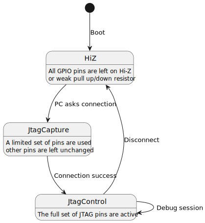

# <big>The `Bmt::Gpio` Name-Space</big>

The template classes exposed by this namespace shows the real advantage 
of combining templates with the `constexpr` C++ keyword.

A good example of an blue-pill application using the LCD1602 and a LED:
```cpp
using namespace Bmt;

// A data-type to setup the Port A GPIO
typedef Gpio::AnyPortSetup<
	Gpio::Port::PA,
	Gpio::Unused<0>,					// unused pin (input + pull-down)
	Gpio::AnyOut<Gpio::Port::PA, 1>,	// LCD1602 RS pin
	Gpio::AnyOut<Gpio::Port::PA, 2>,	// LCD1602 RW pin
	Gpio::AnyOut<Gpio::Port::PA, 3>,	// LCD1602 EN pin
	Gpio::AnyOut<Gpio::Port::PA, 4>,	// LCD1602 D4 pin
	Gpio::AnyOut<Gpio::Port::PA, 5>,	// LCD1602 D5 pin
	Gpio::AnyOut<Gpio::Port::PA, 6>,	// LCD1602 D6 pin
	Gpio::AnyOut<Gpio::Port::PA, 7>,	// LCD1602 D7 pin
	Gpio::Unused<8>,					// unused pin (input + pull-down)
	Gpio::Unused<9>,					// unused pin (input + pull-down)
	Gpio::Unused<10>,					// unused pin (input + pull-down)
	Gpio::Unused<11>,					// unused pin (input + pull-down)
	Gpio::Unused<12>,					// unused pin (input + pull-down)
	Gpio::Unchanged<13>,				// unchanged pin used for debugger
	Gpio::Unchanged<14>,				// unchanged pin used for debugger
	Gpio::Unchanged<15>					// unchanged pin used for debugger
> InitPA;

// Port B is entirely unused
typedef Gpio::AnyPortSetup <
	Gpio::Port::PB
> InitPB;

//! LED is connected to PC13 on BluePill
typedef Gpio::AnyOut<Gpio::Port::PC, 13> Led;
typedef Gpio::AnyPortSetup <
	Gpio::Port::PC,
	Gpio::Unused<0>,		// unused pin (input + pull-down)
	Gpio::Unused<1>,		// unused pin (input + pull-down)
	Gpio::Unused<2>,		// unused pin (input + pull-down)
	Gpio::Unused<3>,		// unused pin (input + pull-down)
	Gpio::Unused<4>,		// unused pin (input + pull-down)
	Gpio::Unused<5>,		// unused pin (input + pull-down)
	Gpio::Unused<6>,		// unused pin (input + pull-down)
	Gpio::Unused<7>,		// unused pin (input + pull-down)
	Gpio::Unused<8>,		// unused pin (input + pull-down)
	Gpio::Unused<9>,		// unused pin (input + pull-down)
	Gpio::Unused<10>,		// unused pin (input + pull-down)
	Gpio::Unused<11>,		// unused pin (input + pull-down)
	Gpio::Unused<12>,		// unused pin (input + pull-down)
	Led,					// LED on PC13
	Gpio::Unchanged<14>,
	Gpio::Unchanged<15>
> InitPC;
```

At the center of this design is the `AnyPinGroup<>` template, which is 
the base template for `AnyPortSetup<>`. You can see a definition of this 
data-type as a working state of a pin group of your GPIO, when your 
design enters some specific context.

For example, on the **glossy-msp430** project, you have an initial state 
where firmware assigns default functions for each GPIO pin. Later, 
prompting for a command received by the PC, it establishes a JTAG 
connection to a target MSP430 chip using many MCU resources, such as SPI, 
Timers, DMA and the classic bit-banging on some pins.

Because of the nature of a JTAG connection, the firmware starts this bus 
using Hi-Z. During the target reset, some pins are are bit-banged while 
others are kept in Hi-Z. Finally, when the JTAG target is captured, all 
bus pins enters low impedance.



<div hidden>
```
@startuml jtag-debug
[*] --> HiZ : Boot
HiZ : All GPIO pins are left on Hi-Z
HiZ : or weak pull up/down resistor
HiZ --> JtagCapture : PC asks connection
JtagCapture : A limited set of pins are used
JtagCapture : other pins are left unchanged
JtagCapture --> JtagControl : Connection success
JtagControl : The full set of JTAG pins are active
JtagControl --> JtagControl : Debug session
JtagControl --> HiZ : Disconnect
@enduml
```
</div>

Imagine now that through the `AnyPinGroup<>` template you define each of 
these states and through a simple `MyType::Enable()` call alls GPIO pins 
are configured using the least possible number of instructions, almost 
exactly if you code everything in assembly and lots of manual 
bit-constant calculation for the values involved for each case.

In C++, you work with many `typedef`, combining them as much as possible, 
which are *abstractions* that compute in *compile-time* each of the 
constant involved on a specific operation.

Lets dive into details, starting from the ground up.

# Elementary Data-Types

The following data-types are all strongly typed enumerations, which are 
shared among all supported devices.  
The are used for the configuration of individual pins. 

> Some of the combinations may not make sense for your specific hardware, 
> since modern parts have more features.

## The `Gpio::Port` Enumeration

This is the enumeration that identifies one of your GPIO unit, which 
depends on your hardware.  
The definition of the data type is:

```cpp
/// All possible GPIO peripherals
enum class Port
{
	PA = 0,		///< Port A
	PB = 1,		///< Port B
	PC = 2,		///< Port C
#ifdef GPIOD
	PD = 3,		///< Port D
#endif
#ifdef GPIOE
	PE = 4,		///< Port E
#endif
#ifdef GPIOF
	PF = 5,		///< Port F
#endif
#ifdef GPIOG
	PG = 6,		///< Port G
#endif
#ifdef GPIOH
	PH = 7,		///< Port H
#endif
	kUnusedPort = -1
};
```

Through the use of conditional compilation, it translates implemented 
GPIO instances to a strongly typed enumeration.

> Note that the conditional compilation depends on the BSP file you are 
> including and the device macro. See the installation guide for details 
> on this.


## The `Mode` Enumeration

This is the `Mode` enumeration:

```cpp
/// GPIO pin mode of operation
enum class Mode
{
	kInput = 0,				///< Input pin
	kAnalog,				///< Analog pin
	kOutput,				///< General purpose output (push/pull)
	kOpenDrain,				///< General purpose output (Open drain)
	kAlternate,				///< Alternate function (push/pull)
	kOpenDrainAlt,			///< Alternate function (Open drain)
};
```

This enumeration specifies the mode of operation of a single GPIO pin. 
There are thorough documentation on the device data-sheet, which may have 
subtle differences depending on the specific part.

In general:
- `kInput` is used to configure a pin to read digital states.
- `kAnalog` is used to configure the pin for an analog function, 
typically the ADC.
- `kOutput` is used to configure a pin as output. The state is defined by 
software and is typically used when bit-banging a pin.
- `kOpenDrain` works like `kOutput`, but the output drivers are 
configured as open drain. In such operating mode it is required a pull-up 
resistor, which should be provided in the hardware design or the 
alternative weak pull-up of the MCU. There is another enumeration to 
configure the behavior of the internal pull-up resistor.
- `kAlternate` is used to activate alternate mode, which means that the 
pin will be controlled by any of the allowed embedded peripheral.  
Usually another parameter complete this mode, which varies slightly 
depending on the MCU model. In general newer MCUs have more flexible 
peripheral selection options.
- `kOpenDrainAlt` is exactly the same as the previous option, but the 
output drivers are configured as open drain. Please note that the use of 
weak pull-up resistor will reduce the speed of the bus. This can be an 
issue when longer lines/wires are used.


## The `Speed` Enumeration

On the STM32 you are allowed to configure the bus speed, using this 
enumeration:

```cpp
/// Output pin speed configuration (device specific)
enum class Speed
{
	kInput = 0,				///< Input pin
	kSlow = 0,				///< Low speed
	kMedium = 1,			///< Intermediate speed
	kFast = 2,				///< Lowest speed and lowest energy consumption
	kFastest = 3			///< Maximum speed and highest energy consumption (> 50 Mhz)
};
```

Note that the speed configures how strong the output drivers will control 
the pin. Lines with more load capacitance require stronger outputs, to 
ensure that they are properly discharged. Note that short PCB paths tends 
to work without hassle and require less strength. 

> Its is important to note that this configuration may have an impact on 
> power consumption. If you are designing a low power device, consider 
> tuning these parameter, to improve battery performance.


## The `PuPd` Enumeration

This enumeration controls the use of the embedded pull-up and down 
resistors on each pin:

```cpp
/// Pull-up or Pull-down feature
enum class PuPd
{
	kFloating = 0,			///< Floating pin
	kPullUp,				///< Activates internal Pull-up
	kPullDown,				///< Activates internal Pull-down
};
```

In general this affects the input behavior of the internal pull up and 
down resistors. On older models this affects the behavior of the pins 
only when configured as input. Newer models can control the presence of 
the resistor load also when pin is configured as output.  
Check device data-sheet for more details.

## The `Level` Enumeration

```cpp
/// Pin voltage/logical level
enum class Level
{
	kLow = 0,				///< Drive pin to low voltage level
	kHigh = 1				///< Drive pin to high voltage level
};
```

This information indicates what is the output level of the pin. When the 
pin is configured as input this parameter has no effect.


# Pin Remapping Feature

The GPIO of a STM32 MCU allows for many possible uses. The normal way is 
the typical bit-banging, but when you want to interface a peripheral with 
the outer world you have to remap a pin to connect to a different source.

Depending on the STM32 model there are quite different possibilities to 
remap a GPIO pin. Older models are less flexible while newer models 
have powerful multiplexers.

In general a template called `AnyAFR<>` will represent the remapping 
hardware present on your device.

As already mentioned this definition differs substantially according to 
your target device.

In general it is not important to know how to specify a data-type based 
on the `AnyAFR<>` template, since all possible definitions are already 
provided.  
For every implemented target you will find the **\<family>/pinremap.h** file 
with all possible instances.

We will cover teach particular family in the next subtopics.


## STM32F1xx Family

For the STM32F103 you have the following type definition:

```cpp
template<
	const uint32_t CONF			///< The specific configuration bits
	, const uint32_t MASK		///< The mask to clear the configuration bits
	>
struct AnyAFR
{
	//...

	/// Enables the alternate function
	static void Enable(void);
	/// Disables the alternate function
	static void Disable(void);
};

/// No pin remapping (for regular GPIO function)
typedef AnyAFR<0x00000000U, 0xFFFFFFFF> AfNoRemap;

```

In general for this family two parameters are used with configuration and 
mask for the `AFR` register, while a specific combination is considered 
as *no remapping*, the reserved `AfNoRemap` symbol.

You can always `Enable()` or `Disable()` a configuration, which is 
rarely needed since this is covered by the `AnyPinGroup<>` template, 
covered later on this document.

The interesting part is the **f1xx/pinremap.h** file, which contains all 
definitions, and we list a brief excerpt here:

```cpp
#pragma once

namespace Bmt
{
namespace Gpio
{

// SPI1
/// SPI1 alternate configuration 1 using PA4, PA5, PA6 and PA7
typedef AnyAFR<0x00000000U, ~AFIO_MAPR_SPI1_REMAP_Msk> AfSpi1_PA4_5_6_7;
/// SPI1 alternate configuration 2 using PA15, PB3, PB4 and PB5
typedef AnyAFR<AFIO_MAPR_SPI1_REMAP, ~AFIO_MAPR_SPI1_REMAP_Msk> AfSpi1_PA15_PB3_4_5;

//...

// USART1
/// USART1 alternate configuration 1 using PA9 and PA10
typedef AnyAFR<0x00000000U, ~AFIO_MAPR_USART1_REMAP_Msk> AfUsart1_PA9_10;

//...

/// 2-pin JTAG bus active (3-pin with optional SWO)
typedef AnyAFR<AFIO_MAPR_SWJ_CFG_JTAGDISABLE, ~AFIO_MAPR_SWJ_CFG_Msk> AfSwd3;
/// No emulation active
typedef AnyAFR<AFIO_MAPR_SWJ_CFG_DISABLE, ~AFIO_MAPR_SWJ_CFG_Msk> AfSwd2;

}	// namespace Gpio
}	// namespace Bmt
```

So in general you have specific data type definitions listed on this file 
for each possible configuration.

So, for example, you can activate the 3-pin SWD debug interface by 
calling:

```cpp
AfSwd3::Enable();
```

In general you will not need to call individually each possible 
configuration, since we can solve this in a single *batch*, as we will 
cover later in the `AnyPinGroup<>` template documentation.


## STM32L4xx and STM32G4xx Family

For the STM32L432 and STM32G431 you have the following type definition:

```cpp
/// Alternate function value
enum class AF : uint8_t
{
	k0,
	k1,
	//...
	k15,
};

/// A template class for Alternate GPIO Function initialization
template<
	const Gpio::Port kPort		///< The specific configuration bits
	, const uint8_t kPin		///< Port bit for the configuration
	, const AF kAfr				///< The value for AFRx register
	>
struct AnyAFR
{
	//...

	/// Enables the alternate function
	static void Enable(void);
	/// Disables the alternate function (don't care)
	static void Disable(void);
};

// Used to deactivate remapping
typedef AnyAFR<Port::kUnusedPort, 0, AF::k0> AfNoRemap;
```

The template definition for this family is quite different from the older 
brothers, and features a dedicated and independent multiplexer for each 
GPIO pin, so an additional information was added.

Similar to the previous family, the `AfNoRemap` symbol is reserved to 
indicate a ordinary GPIO pin.

While the `Enable()` command acts like in the previous family, the 
`Disable()` has no effect, since the remapping feature is controlled 
directly on the GPIO registers (i.e, there is no dedicated remapping 
unit).

As with the previous family, you will find the **l4xx/pinremap.h** file 
with a huge list of available configurations:

```cpp
#pragma once

namespace Bmt
{
namespace Gpio
{

// SYS
typedef AnyAFR<Port::PA, 8, AF::k0>		AfMCO_PA8;
typedef AnyAFR<Port::PA, 14, AF::k0>	AfJTCK_PA14;
typedef AnyAFR<Port::PA, 15, AF::k0>	AfJTDI_PA15;

//...

// I2C1
typedef AnyAFR<Port::PA, 9, AF::k4>		AfI2C1_SCL_PA9;
typedef AnyAFR<Port::PB, 6, AF::k4>		AfI2C1_SCL_PB6;
typedef AnyAFR<Port::PB, 8, AF::k4>		AfI2C1_SCL_PB8;

//...

typedef AnyAFR<Port::PI, 10, AF::k15>	AfEVENTOUT_PI10;
typedef AnyAFR<Port::PI, 11, AF::k15>	AfEVENTOUT_PI11;
#endif	// defined(GPIOI_BASE)


}	// namespace Gpio
}	// namespace Bmt
```

Because of the nature of this hardware implementation, each pin has to be 
configured individually, which is really not practical, without the use 
of the `AnyPinGroup<>` template class covered later in this document.


# The `AnyPin<>` Template Class

This is a template class that completely defines the behavior of GPIO pin. 
This is the template definition for the STM32F1xx family:

```cpp
template<
	const Port kPort						///< The GPIO port
	, const uint8_t kPin					///< The pin of the port
	, const Mode kMode = Mode::kInput		///< Mode to configure the port
	, const Speed kSpeed = Speed::kInput	///< Speed for the pin
	, const PuPd kPuPd = PuPd::kFloating	///< Additional pin configuration (applies to input pin)
	, const Level kLevel = Level::kLow		///< Initial pin level (applies to output pin)
	, typename Map = AfNoRemap				///< Pin remapping feature (pinremap.h)
>
class AnyPin : public Private::Implementation_<
	Private::Impl::kNormal
	, kPort
	, kPin
	, kMode
	, kSpeed
	, kPuPd
	, kLevel
	, Map
>
{};
```

When using the **bmt** library you are encourage to create data-types for 
each pin you have assigned in your hardware design.
This data-types describe the settings of your pin. Later when grouping 
pins, the library will merge bits and masks to produce an optimized 
access to the hardware registers.

The `AnyPin<>` template lets you specify the pin function in every 
possible detail. Some combinations may not work due to hardware 
limitation.

A set of attributes and methods is available when using an override of 
this class, covered on the next sub-topics.


## Available Methods

All basic operations common to a GPIO are provided by the `AnyPin<>` 
data-type. Note that all methods are static, so no instance is required 
(Actually the instances are implemented as hardware registers inside the
chip design).

### The `Io()` Method

Returns a reference to the `GPIO_TypeDef` structure, which allows for low 
level access to the GPIO registers.

### The `SetupPinMode()` Method

This sets the pin mode according to template parameters. This is 
restricted only to the pin mode (CRL and CRH registers).  
Use the `Setup()` for the complete pin configuration.

### The `Setup()` Method

This method performs a complete setup for the GPIO pin, including mode, 
mapping and output level.

### The `Setup(mode, speed, pupd)` Method

This method overrides the settings provided on the template creation 
and sets a custom configuration.

It is not recommended to use this method. Instead create another type 
definition for the pin and call the standard `Enable()` method. There is 
no instance for the data-type and thus no additional cost.

### The `SetHigh()` Method

This method set the GPIO pin to high level. Note that on earlier STM32 
devices this may also affect the Pull-Up resistor for input pins.  
This rule does not apply for modern versions of the STM32 series.

### The `SetLow()` Method

This method set the GPIO pin to low level. Note that on earlier STM32 
devices this may also affect the Pull-Down polarity for input pins.  
This rule does not apply for modern versions of the STM32 series.

### The `Set(level)` Method

This method sets the pin level according to given boolean argument. 

### The `Get()` Method

This method reads the current port state and returns as a boolean value.

### The `IsHigh()` Method

This method returns true if the pin read is in high state.

### The `IsLow()` Method

This method returns true if the pin read is in low state.

### The `Toggle()` Method

This method toggles the state of the GPIO output.


## Constants Defined For the Data-Type

A series of constants are defined to implement the pin functionality:

| Constant      | Data Type         | Description                           |
|:--------------|:------------------|:--------------------------------------|
| `kPort_`      | `Bmt::Gpio::Port` | GPIO port                             |
| `kPortBase_`  | `uint32_t`        | Base address of the port HW registers |
| `kPin_`       | `uint8_t`         | The pin number                        |
| `kSpeed_`     | `Bmt::Gpio::Speed`| The pin speed                         |
| `kMode_`      | `Bmt::Gpio::Mode` | The pin mode                          |
| `kPuPd_`      | `Bmt::Gpio::PuPd` | The Pul-up/Pull-down configuration    |
| `kIsInput_`   | `bool`            | `true` for input pins                 |
| `kIsPuPd_`    | `bool`            | `false` for floating pins             |
| `kCrBits_`    | `uint8_t`         | Raw value for **CR*x*** register      |
| `kCRL_`       | `uint32_t`        | Value for **CRL** register            |
| `kCRH_`       | `uint32_t`        | Value for **CRH** register            |
| `kCRL_Mask_`  | `uint32_t`        | Mask value for **CRL** register       |
| `kCRH_Mask_`  | `uint32_t`        | Mask value for **CRH** register       |
| `kBitValue_`  | `uint16_t`        | Bit value                             |
| `kBsrrValue_` | `uint32_t`        | Value for **BSRR** register           |
| `kODR_`       | `uint16_t`        | Value for **ODR** register            |
| `kODR_Mask_`  | `uint16_t`        | Mask value for **ODR** register       |
| `kAfConf_`    | `uint32_t`        | Value for the **AFR** register        |
| `kAfMask_`    | `uint32_t`        | Mask value for the **AFR** register   |

> These values are probably of no use for most cases.


## Example

The classical LED blink application:

```cpp
using namespace Bmt::Gpio;

//! LED is connected to PC13 on BluePill
typedef AnyPin<Port::PC, 13, Mode::kOutput, Speed::kSlow> Led;

/*
This assumes that the PC13 was properly initialized 
(see Bmt::Gpio::AnyPortSetup<> later on) 
*/
int main()
{
	while (true)
	{
		// A reasonable delay to see the LED blinking
		for(volatile int i = 0; i < 250000; ++i)
			__NOP();
		// Toggle the LED
		Led::Toggle();
	}
	return 0;
}
```


# The `AnyPin<>` Template Class Specializations

Since the universality of this template, other template specialization 
exists to cover usual project requirements, listed below:


## The `AnyAnalog<>` Template

This is a reduced form of the `AnyPin<>`, optimized for Analog pins, 
which looks like this:

```cpp
//! Template for analog pins
template<
	const Port kPort						///< The GPIO port
	, const uint8_t kPin					///< The pin of the port
	, typename Map = AfNoRemap				///< Pin remapping feature (pinremap.h)
>
class AnyAnalog : public Private::Implementation_<
	Private::Impl::kNormal
	, kPort
	, kPin
	, Mode::kAnalog
	, Speed::kInput
	, PuPd::kFloating
	, Level::kLow
	, Map
>
{};
```


## The `AnyIn<>` Template

This is a specialized template to initialize a pin as **Input**: 

```cpp
//! Template for input pins
template<
	const Port kPort						///< The GPIO port
	, const uint8_t kPin					///< The pin of the port
	, const PuPd kPuPd = PuPd::kFloating	///< Additional pin configuration 
											///< (applies to input pin)
	, typename Map = AfNoRemap				///< Pin remapping feature (pinremap.h)
>
class AnyIn : public Private::Implementation_<
	Private::Impl::kNormal
	, kPort
	, kPin
	, Mode::kInput
	, Speed::kInput
	, kPuPd
	, Level::kLow
	, Map
>
{};
```

The following example specifies the PA8 pin as floating input for TIM1 
CH1 function:

```cpp
/// A configuration to map TIM1 CH1 floating pin on PA8
typedef AnyPin<Port::PA, 8, PuPd::kFloating, AfTim1_PA12_8_9_10_11_PB12_13_14_15>
	TimCh1In;
```

> A similar setting is already available on the **gpio-types.h** file.

You can always activate this pin configuration with a simple command like:

```cpp
TimCh1In::Enable();
```


## The `Floating<>` Template

This is a specialization of the `AnyIn<>` template to initialize a pin as 
a **floating input**: 

```cpp
/// A template class to configure a port pin as a floating input pin
template <
	const Port kPort			///< The GPIO port
	, const uint8_t kPin		///< The GPIO pin number
	, typename Map = AfNoRemap	///< Pin remapping feature (pinremap.h)
>
class Floating : public AnyIn<kPort, kPin, PuPd::kFloating, Map>
{
};
```

Repeating the last example, using this template class we can repeat the 
definition less verbosely:

```cpp
/// A configuration to map TIM1 CH1 floating pin on PA8
typedef Floating<Port::PA, 8, AfTim1_PA12_8_9_10_11_PB12_13_14_15>
	TimCh1In;
```


## The `AnyInPu<>` Template

This is a specialization of the `AnyIn<>` template to initialize a pin as 
an **input** with the internal **weak pull-up** resistor active: 

```cpp
/// A template class to configure a port pin as digital input having a pull-up
template <
	const Port kPort
	, const uint8_t kPin
	, typename Map = AfNoRemap	///< Pin remapping feature (pinremap.h)
>
class AnyInPu : public AnyIn<kPort, kPin, PuPd::kPullUp, Map>
{
};
```


## The `AnyInPd<>` Template

```cpp
/// A template class to configure a port pin as digital input having a pull-down
template <
	const Port kPort
	, const uint8_t kPin
	, typename Map = AfNoRemap	///< Pin remapping feature (pinremap.h)
>
class AnyInPd : public AnyIn<kPort, kPin, PuPd::kPullDown, Map>
{
};
```


## The `AnyOut<>` Template

```cpp
//! Template for output pins
template<
	const Port kPort					///< The GPIO port
	, const uint8_t kPin				///< The pin of the port
	, const Speed kSpeed = Speed::kFast	///< Speed for the pin
	, const Level kLevel = Level::kLow	///< Initial pin level (applies to output pin)
	, const Mode kMode = Mode::kOutput	///< Mode to configure the port
	, typename Map = AfNoRemap			///< Pin remapping feature (pinremap.h)
>
class AnyOut : public Private::Implementation_<
	Private::Impl::kNormal
	, kPort
	, kPin
	, kMode
	, kSpeed
	, PuPd::kFloating
	, kLevel
	, Map
>
{
};
```

For example, a valid configuration for the LED on a blue-pill is:

```cpp
using namespace Bmt::Gpio;

//! LED is connected to PC13 on BluePill
typedef AnyOut<Port::PC, 13, Speed::kSlow> Led;
```


## The `AnyFastOut0<>` Template

```cpp
//! Template for fast output pins at logic level low
template<
	const Port kPort							///< The GPIO port
	, const uint8_t kPin						///< The pin of the port
	, typename Map = AfNoRemap					///< Pin remapping feature (pinremap.h)
>
class AnyFastOut0 : public AnyOut<
	kPort
	, kPin
	, Speed::kFast
	, Level::kLow
	, Mode::kOutput
	, Map
>
{
};
```


## The `AnyFastOut1<>` Template

```cpp
//! Template for fast output pins at logic level hi
template<
	const Port kPort							///< The GPIO port
	, const uint8_t kPin						///< The pin of the port
	, typename Map = AfNoRemap					///< Pin remapping feature (pinremap.h)
>
class AnyFastOut1 : public AnyOut<
	kPort
	, kPin
	, Speed::kFast
	, Level::kHigh
	, Mode::kOutput
	, Map
>
{
};
```


## The `AnyOutOD<>` Template

```cpp
//! Template for open drain output pins
template<
	const Port kPort						///< The GPIO port
	, const uint8_t kPin						///< The pin of the port
	, const Speed kSpeed = Speed::kFast			///< Speed for the pin
	, const Level kLevel = Level::kLow			///< Initial pin level (applies to output pin)
	, typename Map = AfNoRemap					///< Pin remapping feature (pinremap.h)
>
class AnyOutOD : public AnyOut<
	kPort
	, kPin
	, kSpeed
	, kLevel
	, Mode::kOpenDrain
	, Map
>
{
};
```


## The `AnyAltOut<>` Template

```cpp
//! Template for generic alternate output pins
template<
	const Port kPort						///< The GPIO port
	, const uint8_t kPin						///< The pin of the port
	, typename Map								///< Pin remapping feature (pinremap.h)
	, const Speed kSpeed = Speed::kFast			///< Speed for the pin
	, const Level kLevel = Level::kLow			///< Initial pin level (applies to output pin)
	, const PuPd kPuPd = PuPd::kFloating		///< Additional pin configuration
	, const Mode kMode = Mode::kAlternate		///< Mode to configure the port
>
class AnyAltOut : public Private::Implementation_<
	Private::Impl::kNormal
	, kPort
	, kPin
	, kMode
	, kSpeed
	, kPuPd
	, kLevel
	, Map
>
{
};
```

For example, the **f1xx/gpio-types.h** file contains almost every 
available function of this MCU model, ready to be used. Lets take the 
definition of the SCK pin of the SPI1 peripheral. On the default 
configuration, this pin is tied to the **PA5** pin.

```cpp
/// A default configuration to map SPI1 SCK on PA5 pin (master)
typedef AnyAltOut<Port::PA, 5, AfSpi1_PA4_5_6_7> SPI1_SCK_PA5;
```


## The `AnyAltOutPP<>` Template

```cpp
//! Template for Push-Pull alternate output pins
template<
	const Port kPort						///< The GPIO port
	, const uint8_t kPin						///< The pin of the port
	, typename Map								///< Pin remapping feature (pinremap.h)
	, const Speed kSpeed = Speed::kFast			///< Speed for the pin
	, const Level kLevel = Level::kLow			///< Initial pin level (applies to output pin)
>
class AnyAltOutPP : public AnyAltOut <
	kPort
	, kPin
	, Map
	, kSpeed
	, kLevel
	, PuPd::kFloating
	, Mode::kAlternate
>
{
};
```


## The `AnyAltOutOD<>` Template

```cpp
//! Template for Open-Drain alternate output pins
template<
	const Port kPort						///< The GPIO port
	, const uint8_t kPin						///< The pin of the port
	, typename Map								///< Pin remapping feature (pinremap.h)
	, const Speed kSpeed = Speed::kFast			///< Speed for the pin
	, const Level kLevel = Level::kLow			///< Initial pin level (applies to output pin)
>
class AnyAltOutOD : public AnyAltOut <
	kPort
	, kPin
	, Map
	, kSpeed
	, kLevel
	, PuPd::kPullUp		// unsupported by this hardware
	, Mode::kOpenDrainAlt
>
{
};
```


## Special `Unchanged<>` and `Unused<>` Configurations

The library defines two special base template classes that has a special 
implementation and behavior. 

The **`Unused<>`** template defines a pin behavior for unused pins. This 
configuration will setup a pin as input and activates the pull-down 
resistor to avoid undesired signal floating. The template alternatively 
allows for a pull-up setting. 

The **`Unchanged<>`** template defines a behavior for a pin that we does 
not want to change. Pins of this type does not react to method calls like 
`Set()` or `Get()` because implementation for them are empty.

The main purpose of these classes is to participate in pin groups, as we 
will see next and specify a consistent behavior when group commands are 
issued.

The table below illustrates behavior for the three possible pin 
configurations when using the **bmt** library:

| Method/Operation              | Normal Pin | `Unchanged<>` | `Unused<>` |
|-------------------------------|:----------:|:-------------:|:----------:|
| Initialization                |      Y     |       N       |     Y      |
| Initialization of Pin Mapping |      Y     |       N       |     N      |
| `SetupPinMode()`              |      Y     |       N       |     Y      |
| `Setup()`                     |      Y     |       N       |     Y      |
| `Setup(mode, speed, pupd)`    |      Y     |       N       |     N      |
| `Set()`                       |      Y     |       N       |     Y      |
| `SetHigh()`                   |      Y     |       N       |     Y      |
| `SetLow()`                    |      Y     |       N       |     Y      |
| `Get()`                       |      Y     |       N       |     Y      |
| `IsHigh()`                    |      Y     |       N       |     Y      |
| `IsLow()`                     |      Y     |       N       |     Y      |
| `Toggle()`                    |      Y     |       N       |     Y      |

The table shows that and `Unused<>` pin can react specifically to most 
explicit commands, like normal pins, although it is not possible to change 
mode and direction. So the effect of using these method calls are probably 
useless for most use cases.

`Unchanged<>` pins are literally void. Although it is possible to call 
the pin methods they are compile to empty inline functions. This can be 
useful to temporarily disable a specific pin definition for a test, 
without the need to commenting all code places out.

But the real purpose of these pins are the inter-operation with the 
`AnyPinGroup<>` template covered next.


# The `AnyPinGroup<>` Template

This is a very powerful template class and is designed to combine 
functionality from many GPIO pins into a single type definition. Then it 
allows to configure the entire GPIO bus in a batch, regardless of pin 
function, polarity or direction.

This is the definition:

```cpp
template <
	const Port kPort					/// The GPIO port number
	, typename Pin0 = Unchanged<0>		/// Definition for any pin, any order
	, typename Pin1 = Unchanged<1>		/// Definition for any pin, any order
	, typename Pin2 = Unchanged<2>		/// Definition for any pin, any order
	, typename Pin3 = Unchanged<3>		/// Definition for any pin, any order
	, typename Pin4 = Unchanged<4>		/// Definition for any pin, any order
	, typename Pin5 = Unchanged<5>		/// Definition for any pin, any order
	, typename Pin6 = Unchanged<6>		/// Definition for any pin, any order
	, typename Pin7 = Unchanged<7>		/// Definition for any pin, any order
	, typename Pin8 = Unchanged<8>		/// Definition for any pin, any order
	, typename Pin9 = Unchanged<9>		/// Definition for any pin, any order
	, typename Pin10 = Unchanged<10>	/// Definition for any pin, any order
	, typename Pin11 = Unchanged<11>	/// Definition for any pin, any order
	, typename Pin12 = Unchanged<12>	/// Definition for any pin, any order
	, typename Pin13 = Unchanged<13>	/// Definition for any pin, any order
	, typename Pin14 = Unchanged<14>	/// Definition for any pin, any order
	, typename Pin15 = Unchanged<15>	/// Definition for any pin, any order
	>
class AnyPinGroup
{
	//...
};
```

As you can see the template allows you to specify all 16 pin functions 
for the specified GPIO port. 

> Note that although the pin naming used suggests a pin sequence (Pin0, 
> Pin1, ..., Pin15) it is not necessary to specify pins in ascending 
> order. Though you cannot have a pin number clash, or the compiler will 
> assert.  
>  This requirement is different for the `AnyPortSetup<>` specialization 
> covered later on this documentation.

The template shown above defines default parameters as `Unchanged<>` for 
all pins, so if you specify a group with still two pins, no effect will
be caused for the other template slots.


## Available Methods

Now lets cover the methods available for this template.

### The `Io()` Method

Returns a pointer to the `GPIO_TypeDef*` structure, which allows low 
level access to the GPIO registers.

### The `Enable()` Method

This method applies the group configuration to hardware registers.
Note that it is assumed that the GPIO port was already initialized. 
Later we will cover the `AnyPortSetup<>` template which is designed for 
this operation. 

### The `Disable()` Method

Do not use. This method is deprecated and will be removed or refactoried. 


## Example

Lets say we want to control the SPI1 on a STM32F103 in master function, 
we define the following data-type:

```cpp
using namespace Bmt::Gpio;
// Note these template used ready-made definitions found on 'gpio-types.h'
typedef AnyPinGroup<
	Port::PA,
	SPI1_NSS_PA4,
	SPI1_SCK_PA5,
	SPI1_MISO_PA6,
	SPI1_MOSI_PA7
> SpiOn;
// Configuration to disable SPI1
typedef AnyPinGroup<
	Port::PA,
	Unused<4, PuPd::kPullUp>,
	Unused<5>,
	Unused<6>,
	Unused<7>,
> SpiOff;

void Test()
{
	//...

	// Setup SPI device pins
	SpiOn::Enable();

	// TODO: now use the SPI device

	//...

	// Disable SPI1 after use (i.e. enables the *off* state of the SPI1)
	SpiOff::Enable()
}
```

Please observe that the concept of *group* here is a specific **state** 
of the GPIO pins and the `Enable()` method is used to enter the state.


# The `AnyPortSetup<>` Template

This template is an override of the `AnyPinGroup<>` template class and is 
designed for device initialization.

The idea here is to *collect* all pin functionality of a firmware into a 
single data-type so firmware initializes the entire ports a single time.

Later you can define groups to control specific pins like the previous 
example, but the first time initialization is obligatory, since internal 
clock signals are initialized here.

The following restriction applies to this template class:
- Pin definitions have to be ordered or a compilation error happens
- Call the `Init()` method to apply the entire GPIO configuration, 
including internal clock settings.
- Pins like the JTAG/SWD bus have to be initialized as `Unused<>` for a 
feasible Debug session.

## Example

As example, the following code-snippet was taken from the 
`03-gpio-lcd1602` example. It initializes the GPIO bus to drive a 
standard LCD1602 using the following connections:

| Pin  | Function                        |
|------|---------------------------------|
| PA1  | LCD1602 RS pin                  |
| PA2  | LCD1602 RW pin                  |
| PA3  | LCD1602 EN pin                  |
| PA4  | LCD1602 D4 pin                  |
| PA5  | LCD1602 D5 pin                  |
| PA6  | LCD1602 D6 pin                  |
| PA7  | LCD1602 D7 pin                  |
| PA13 | Unchanged for SWD/JTAG function |
| PA14 | Unchanged for SWD/JTAG function |
| PA15 | Unchanged for SWD/JTAG function |
| PC13 | Red LED (blue-pill board)       |
| PC14 | XTAL function                   |
| PC15 | XTAL function                   |

All other pins are unused and configured as inputs.

This is the type definitions for this example:

```cpp
// A data-type to setup the Port A GPIO
typedef Gpio::AnyPortSetup<
	Gpio::Port::PA,
	Gpio::Unused<0>,					// unused pin (input + pull-down)
	Gpio::AnyOut<Gpio::Port::PA, 1>,	// LCD1602 RS pin
	Gpio::AnyOut<Gpio::Port::PA, 2>,	// LCD1602 RW pin
	Gpio::AnyOut<Gpio::Port::PA, 3>,	// LCD1602 EN pin
	Gpio::AnyOut<Gpio::Port::PA, 4>,	// LCD1602 D4 pin
	Gpio::AnyOut<Gpio::Port::PA, 5>,	// LCD1602 D5 pin
	Gpio::AnyOut<Gpio::Port::PA, 6>,	// LCD1602 D6 pin
	Gpio::AnyOut<Gpio::Port::PA, 7>,	// LCD1602 D7 pin
	Gpio::Unused<8>,					// unused pin (input + pull-down)
	Gpio::Unused<9>,					// unused pin (input + pull-down)
	Gpio::Unused<10>,					// unused pin (input + pull-down)
	Gpio::Unused<11>,					// unused pin (input + pull-down)
	Gpio::Unused<12>,					// unused pin (input + pull-down)
	Gpio::Unchanged<13>,				// unchanged pin used for debugger
	Gpio::Unchanged<14>,				// unchanged pin used for debugger
	Gpio::Unchanged<15>					// unchanged pin used for debugger
> InitPA;

// Port B is entirely unused
typedef Gpio::AnyPortSetup <
	Gpio::Port::PB
> InitPB;

//! LED is connected to PC13 on BluePill
typedef Gpio::AnyOut<Gpio::Port::PC, 13> Led;
typedef Gpio::AnyPortSetup <
	Gpio::Port::PC,
	Gpio::Unused<0>,		// unused pin (input + pull-down)
	Gpio::Unused<1>,		// unused pin (input + pull-down)
	Gpio::Unused<2>,		// unused pin (input + pull-down)
	Gpio::Unused<3>,		// unused pin (input + pull-down)
	Gpio::Unused<4>,		// unused pin (input + pull-down)
	Gpio::Unused<5>,		// unused pin (input + pull-down)
	Gpio::Unused<6>,		// unused pin (input + pull-down)
	Gpio::Unused<7>,		// unused pin (input + pull-down)
	Gpio::Unused<8>,		// unused pin (input + pull-down)
	Gpio::Unused<9>,		// unused pin (input + pull-down)
	Gpio::Unused<10>,		// unused pin (input + pull-down)
	Gpio::Unused<11>,		// unused pin (input + pull-down)
	Gpio::Unused<12>,		// unused pin (input + pull-down)
	Led,					// LED on PC13
	Gpio::Unchanged<14>,
	Gpio::Unchanged<15>
> InitPC;
```

The hardware initialization happens as usual in the `SystemInit()` 
function, that the firmware developer has to provide:

```cpp
/*
This function is required by STM32 startup file and called during
initial startup.
*/
extern "C" void SystemInit()
{
	// Reset clock system before starting program
	System::Init();
	// Initialize Port A, B and C
	InitPA::Init();
	InitPB::Init();
	InitPC::Init();

	//... initialize other stuff as needed
}
```


# The `AnyCounter<>` Template Class

Using a similar concept as the `AnyPinGroup<>` template class, the 
`AnyCounter<>` template class implements a useful functionality.

This class is able to group up to 4 pins to implement a 4-bit bus.
It handles values in the range of 0 to 15 to set the state of all pins at 
once.

```cpp
// Up to 4 bits that can enumerates a binary sequence out to GPIO lines
template <
	typename Bit0							/// Definition for bit 0
	, typename Bit1							/// Definition for bit 1
	, typename Bit2 = Gpio::Unchanged<2>	/// Definition for bit 2
	, typename Bit3 = Gpio::Unchanged<3>	/// Definition for bit 3
>
class AnyCounter
{
	//...
};
```

While it is recommended to work with sequential pins because of code 
performance you are allowed to define the pins in any desired order, as 
long as sharing the same GPIO port.  
Write performance is not severely affected by bit order, but read 
performance will suffer a lot.

The following methods are provided:
- `Write()`: Write a vale out into the specified bus.
- `WriteComplement()`: Writes the value into the specified bus using the 
inverted polarity.
- `Read()`: Reads the value on the specified bus. Bit values are 
organized properly to form a value between 0 and 15, according to the 
order defined in the template arguments.

> You are allowed to reuse this class for buses with 2 or 3 bits also.


## Example

Following the same example referred with the LCD1602 you can define two pin 
groups for input and output of the D4-D7 pins;

```cpp
using namespace Bmt::Gpio;
// Definition for each bus bit
typedef AnyOut<Gpio::Port::PA, 4> LCD1602_D4;
typedef AnyOut<Gpio::Port::PA, 5> LCD1602_D5;
typedef AnyOut<Gpio::Port::PA, 6> LCD1602_D6;
typedef AnyOut<Gpio::Port::PA, 7> LCD1602_D7;
// Bus configuration for output
typedef AnyPinGroup<
	Port::PA,
	LCD1602_D4,						// LCD1602 D4 pin configured as output
	LCD1602_D5,						// LCD1602 D5 pin configured as output
	LCD1602_D6,						// LCD1602 D6 pin configured as output
	LCD1602_D7						// LCD1602 D7 pin configured as output
> LcdOut;
// Bus configuration for input
typedef AnyPinGroup<
	Port::PA,
	AnyIn<Gpio::Port::PA, 4>,		// LCD1602 D4 pin configured as input
	AnyIn<Gpio::Port::PA, 5>,		// LCD1602 D5 pin configured as input
	AnyIn<Gpio::Port::PA, 6>,		// LCD1602 D6 pin configured as input
	AnyIn<Gpio::Port::PA, 7>		// LCD1602 D7 pin configured as input
> LcdIn;
// Access to the 4 bits as a counter
typedef AnyCounter<
	LCD1602_D4,
	LCD1602_D5,
	LCD1602_D6,
	LCD1602_D7
> LcdBus;
```

A write routine could look like this:

```cpp
void Write(uint8_t v)
{
	// Sets bus to the output direction
	LcdOut::Enable();
	// Write value to the output
	LcdBus::Write(v);
}
```

A read routine would roughly look like this:

```cpp
uint8_t Read()
{
	// Sets bus to the input direction
	LcdIn::Enable();
	// Read value on the bus and returns
	return LcdBus::Read();
}
```

> This example is a very rough approach on how a data bus would operate. 
> A digital bus requires specific control lines to be set/reset, so that 
> the peripheral knows how to deal with the information present on a bus. 
> Inverting bus direction requires management of proper control lines to 
> avoid bus collision.
