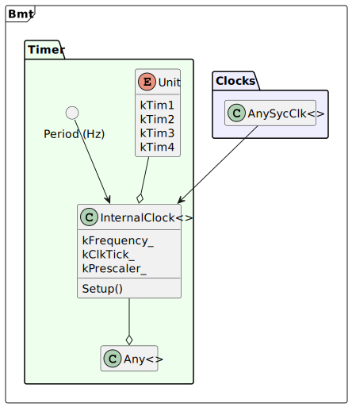
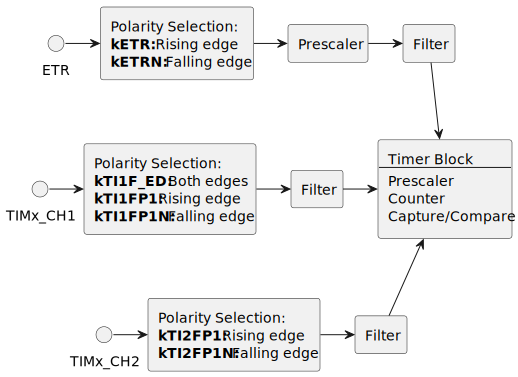
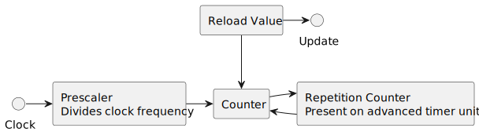

# <big>`Timer` Template Classes</big>

> Operating STM32 timers can be a very complex achievement. Peripherals 
> have too many configuration and documentation does not reveal why some 
> options even exists. Some registers have mutating behavior depending on 
> operating mode, which IMHO is a bad design decision.  
> In general should search for documentation on the web to help you solve 
> specific use cases.

The template classes exposed in **bmt library** covers general use cases. 
It may not cover specific use cases.


# General Library Architecture


<div hidden>
```raw
@startuml timer-classes
namespace Bmt <<Frame>> {
	namespace Clocks #EEEEFF {
		class "AnySycClk<>" as clk
	}
	namespace Timer #EEFFEE {
		class "InternalClock<>" as i_pre
		class "InternalClock_us<>" as i_us
		class "InternalClock_hz<>" as i_hz
		class "ExternalClock<>" as ext
		class "MasterSlaveTimers<>" as ms
		class "Any<>" as any
		class "AnyInputChannel" as ch_in
		class "AnyOutputChannel" as ch_out
	}
}
clk --> i_pre
clk --> i_us
clk --> i_hz
i_pre --o any
i_us --o any
i_hz --o any
ext --o any
ms --o any
any -- ch_in
any -- ch_out
hide clk members
hide i_pre members
hide i_us members
hide i_hz members
hide ext members
hide ms members
hide any members
hide ch_in members
hide ch_out members
@enduml
```
</div>


# Enumerations With Setup Options

The timer template classes are configured through a set of enumerations. 
In general these maps hardware options as an abstraction layer.

## The `Unit` Enumeration

The unit enumeration contains one identification for each hardware 
implemented timer unit.  
It shows something like this:

```cpp
enum Unit : uintptr_t
{
	kTimInvalid = 0,
#ifdef TIM1_BASE
	kTim1 = TIM1_BASE,		///< Timer 1
#else
	kTim1 = kTimInvalid,
#endif
#ifdef TIM2_BASE
	kTim2 = TIM2_BASE,		///< Timer 2
#else
	kTim2 = kTimInvalid,
#endif

	//...

#ifdef TIM17_BASE
	kTim17 = TIM17_BASE,	///< Timer 17
#else
	kTim17 = kTimInvalid,
#endif
};
```

So, this means that for each specific STM32 family you will have a list 
with values matching your BSP files. The enumeration label associated to 
unsupported timer units are initialized with `Unit::kTimInvalid`.

This type safe value is used to identify a timer inside the 
**bmt library**. 


## The `Channel` Enumeration

The enumeration will look like this:

```cpp
/// The timer channel
enum class Channel
{
	k1			///< Timer Channel 1
	, k2		///< Timer Channel 2
	, k3		///< Timer Channel 3
	, k4		///< Timer Channel 4
};
```

> Note that in newer STM32 hardware up to 6 channels may be used. At the 
> present moment only 4 channels are supported.

This value is used to identify a timer channel.


## The `CaptureEdge` Enumeration

This enumeration controls how an external input senses a digital edge:

```cpp
/// Capture block input control
enum class CaptureEdge
{
	kRising,
	kFalling,
};
```


## The `Mode` Enumeration

This enumeration is used to define the counter behavior for a timer.

```cpp
/// Timer count mode
enum class Mode
{
	kUpCounter,
	kDownCounter,
	kSingleShot,
	kSingleShotDown,
};
```


## The `ExtClk` Enumeration

This enumeration configures the external clock source for a timer.

```cpp
/// External clock source selection
enum class ExtClk
{
	kETR,			///< ETR signal after being prescaled, synchronized then filtered
	kETRN,			///< ETR signal after being prescaled, synchronized then filtered
	kTI1F_ED,		///< The TI1FD signal which sensitive to both signal edges
	kTI1FP1,		///< The TI1FP1 input signal that are the synchronized, filtered TI1
	kTI1FP1N,		///< The negative TI1FP1 input signal
	kTI2FP2,		///< The TI2FP2 input signal that are the synchronized, filtered TI2
	kTI2FP2N,		///< The negative TI2FP2 input signal
};
```


## The `MasterMode` Enumeration

This enumeration configures the master timer mode when connecting two 
timers in a master/slave topology.

```cpp
/// Master timer mode
enum class MasterMode
{
	kUpdate,		///< Sends trigger to slave on every update event
	kEnable,		///< Sends trigger to slave when master is enabled
	kComparePulse,	///< Positive pulse on CC1IF
	kCompare1,		///< OC1REF used as trigger output
	kCompare2,		///< OC1REF used as trigger output
	kCompare3,		///< OC1REF used as trigger output
	kCompare4,		///< OC1REF used as trigger output
};
```


## The `SlaveMode` Enumeration

This enumeration configures the slave timer mode when connecting two 
timers in a master/slave topology.

```cpp
/// Slave timer mode
enum class SlaveMode
{
	kMasterIsClock,	///< Triggers from master are used to generate clock
	kResetCnt,		///< Trigger from master clears the slave counter
	kGatedMode,		///< High triggers from master enables/gates the slave counter clock
	kStartMode,		///< Counter start when master triggers. Only start is controlled
};
```


## The `InputCapture` Enumeration

This enumeration configures a channel input. Please check data-sheet 
documentation for details.

```cpp
/// Timer input for capturing
enum class InputCapture
{
	kTI1FP1,	///< TI1FP1 clock input
	kTI1FP2,	///< TI1FP2 clock input
	kTI2FP1,	///< TI2FP1 clock input
	kTI2FP2,	///< TI2FP2 clock input
	kTI3FP3,	///< TI3FP3 clock input
	kTI3FP4,	///< TI3FP4 clock input
	kTI4FP3,	///< TI4FP3 clock input
	kTI4FP4,	///< TI4FP4 clock input
	kTRC,		///< TRC clock input
};
```


## The `OutMode` Enumeration

This enumeration controls the behavior of an output channel when the 
compare register matches the timer counter.

```cpp
enum class OutMode
{
	kFrozen = 0
	, kSetActive
	, kSetInactive
	, kToggle
	, kForceInactive
	, kForceActive
	, kPWM1
	, kPWM2
};
```


## The `Output` Enumeration

This enumeration configures if a channel output should be disabled, 
enabled or inverted:

```cpp
enum class Output
{
	kDisabled
	, kEnabled
	, kInverted
};
```

# Timer Clock Source

In general a timer can be clocked through a set of different sources. 
like the figure below:


<div hidden>
```raw
@startuml timer-source
namespace Bmt <<Frame>> {
	namespace Clocks #EEEEFF {
		class "AnySycClk<>" as clk
	}
	namespace Timer #EEFFEE {
		class "InternalClock<>" as i_pre {
			kClkTick_
			kPrescaler_
			kFrequency_
			Setup()
		}
		class "InternalClock_us<>" as i_us {
			kClkTick_
			kTimerTick_
			kPrescaler_
			kFrequency_
			Setup()
		}
		class "InternalClock_hz<>" as i_hz {
			kClkTick_
			kPrescaler_
			kFrequency_
			Setup()
		}
		class "ExternalClock<>" as ext {
			kExtIn_
			kClkTick_
			kPrescaler_
			kFrequency_
			kInputPrescaler_
			Setup()
		}
		class "MasterSlaveTimers<>" as ms {
			kMasterTimer_
			kPrescaler_
			Setup()
		}
		class "Any<>" as any
	}
}
clk --> i_pre
clk --> i_us
clk --> i_hz
i_pre --o any
i_us --o any
i_hz --o any
ext --o any
ms --o any
@enduml
```
</div>

The picture shows that you have five options to configure the input clock 
of a timer. Three of them are just different perspective of the system 
clock.


## The `InternalClock<>` Clock Source

This class uses the internal timer clock to drive the timer.


<div hidden>
```raw
@startuml timer-internal-clock
namespace Bmt <<Frame>> {
	namespace Clocks #EEEEFF {
		class "AnySycClk<>" as clk
	}
	namespace Timer #EEFFEE {
		enum Unit {
			kTim1
			kTim2
			kTim3
			kTim4
		}
		circle "Prescaler" as pre
		class "InternalClock<>" as i_pre {
			{static} kClkTick_
			{static} kPrescaler_
			{static} kFrequency_
			Setup()
		}
		class "Any<>" as any
	}
}
clk --> i_pre
pre --> i_pre
Unit --o i_pre
i_pre --o any
hide clk members
hide Unit methods
hide any members
@enduml
```
</div>

This clock source allows one to specify manually a prescaler value. The 
simplified template class declaration follows:

```cpp
//! Template to adjust timer prescaler to register counts
template <
	const Unit kTimerNum
	, typename SysClk
	, const uint32_t kPrescaler = 0U	// max speed
>
class InternalClock : public AnyTimer_<kTimerNum>
{
	//...
}
```

A typical use case on a BluePill STM32F103 would be:

```cpp
// A data-type for the 8 MHz HSE clock
typedef Clocks::AnyHse<> Hse;			// BluePill has a 8MHz XTAL
// A data-type for the clock tree
typedef Clocks::AnySycClk<Hse> SysClk;	// uses HSE for the clock tree

// Computes the prescaler for 1 kHz counter speed (8MHz / 8000)
typedef InternalClock <kTim1, SysClk, 8000UL-1UL> Millisec;
// Timer that overflows every 5 ms (200Hz) [note: count is 0-base]
typedef Timer::Any<Millisec, Mode::kUpCounter, 5UL-1UL> FiveMs;
```

In words:
- The `Hse` data-type represent the 8MHz crystal tied to the **HSE** 
input. 
- The `SysClk` data-type represents the internal clock-tree of the STM32, 
including AHB, HCLK, APB1 and APB2.
- The `Millisec` data-type is used to configure the internal clock for 
the **TIM1** using a prescaler of 4999 units, which divides the 8MHz 
timer clock by 8000, producing a 1 kHz timer frequency.
- Finally, the `FiveMs` data-type represents the **TIM1** timer hardware. 
Here it receives clock specified by `Millisec` data-type, working as an 
**up-counter** and overflowing after 5 clock pulses. This produces a 
200 Hz period.

> Note that this example either specify a timer input nor an output, 
> keeping the example simple. Though update events for the timer are 
> active and could be used as an interrupt source or other possibilities. 


## The `InternalClock_us<>` Clock Source

This class uses the internal timer clock to drive the timer and allows 
the developer to specify a clock period in microseconds. 


<div hidden>
```raw
@startuml timer-internal-clock-us
namespace Bmt <<Frame>> {
	namespace Clocks #EEEEFF {
		class "AnySycClk<>" as clk
	}
	namespace Timer #EEFFEE {
		enum Unit {
			kTim1
			kTim2
			kTim3
			kTim4
		}
		circle "Period (us)" as pre
		class "InternalClock<>" as i_pre {
			{static} kClkTick_
			{static} kTimerTick_
			{static} kPrescaler_
			{static} kFrequency_
			Setup()
		}
		class "Any<>" as any
	}
}
clk --> i_pre
pre --> i_pre
Unit --o i_pre
i_pre --o any
hide clk members
hide Unit methods
hide any members
@enduml
```
</div>

This clock source allows you to specify a period in microsecond for the 
timer clock.  The simplified template class declaration follows:

```cpp
//! Template to adjust timer prescaler to us
template <
	const Unit kTimerNum
	, typename SysClk
	, const uint32_t kMicroSecs = 1000U
>
class InternalClock_us : public AnyTimer_<kTimerNum>
{
	//...
}
```

For example, if we want to produce a timer clock frequency of 1 kHz, we 
modify the previous example like the code below:

```cpp
// A data-type for the 8 MHz HSE clock
typedef Clocks::AnyHse<> Hse;			// BluePill has a 8MHz XTAL
// A data-type for the clock tree
typedef Clocks::AnySycClk<Hse> SysClk;	// uses HSE for the clock tree

// Computes the prescaler for 1000 µS (1 kHz) counter speed 
typedef InternalClock_us <kTim1, SysClk, 1000UL> Millisec;
// Timer that overflows every 5 ms (200Hz) [note: count is 0-base]
typedef Timer::Any<Millisec, Mode::kUpCounter, 5UL-1UL> FiveMs;
```

> This example produces effectively the same clock frequency on a typical 
> Blue-Pill board. But it produces portable code, since it will keep the 
> target frequency independently of the clock tree configuration. Moving 
> the code to another hardware platform tends to work by just 
> recompiling, while the first example will require manually fixing of 
> the prescaler value.


## The `InternalClock_Hz<>` Clock Source

This class uses the internal timer clock to drive the timer and allows 
the developer to specify a clock frequency in Hertz. 



<div hidden>
```raw
@startuml timer-internal-clock-hz
namespace Bmt <<Frame>> {
	namespace Clocks #EEEEFF {
		class "AnySycClk<>" as clk
	}
	namespace Timer #EEFFEE {
		enum Unit {
			kTim1
			kTim2
			kTim3
			kTim4
		}
		circle "Period (Hz)" as pre
		class "InternalClock<>" as i_pre {
			{static} kFrequency_
			{static} kClkTick_
			{static} kPrescaler_
			Setup()
		}
		class "Any<>" as any
	}
}
clk --> i_pre
pre --> i_pre
Unit --o i_pre
i_pre --o any
hide clk members
hide Unit methods
hide any members
@enduml
```
</div>

This clock source allows you to specify a frequency for the timer clock 
in Hz.  The simplified template class declaration follows:

```cpp
//! Template to adjust timer prescaler to Hz
template <
	const Unit kTimerNum
	, typename SysClk
	, const uint32_t kMHz = 1000000
>
class InternalClock_Hz : public AnyTimer_<kTimerNum>
{
	//...
};
```

For example, using the same requirement of the previous example, to 
obtain 1 kHz it is not necessary to compute the period (1 µs). Just 
providing the units in Hertz will be enough.
So the example would look like this:

```cpp
// A data-type for the 8 MHz HSE clock
typedef Clocks::AnyHse<> Hse;			// BluePill has a 8MHz XTAL
// A data-type for the clock tree
typedef Clocks::AnySycClk<Hse> SysClk;	// uses HSE for the clock tree

// Computes the prescaler for 1000 Hz (1 us) counter speed 
typedef InternalClock_Hz <kTim1, SysClk, 1000UL> OneKHz;
// Timer that overflows every 5 ms (200Hz) [note: count is 0-base]
typedef Timer::Any<OneKHz, Mode::kUpCounter, 5UL-1UL> FiveMs;
```

> This example shows another perspective for the solution. For a very 
> trivial case like the one used in this example, it almost does not 
> matter the way we solve, but project specifications will vary a lot and 
> you may profit from this flexibility. 

Note that all three option presented here computes a static constant 
called `kFrequency_`, which exposes the resulting frequency of the 
clock source. You are encouraged to refer to it whenever you want to 
ensure that your code is portable. Think of these constants as the same 
`#define xxx` of a C code, but with the type safety provided by the 
language.


## The `ExternalClock<>` Clock Source

The `ExternalClock<>` clock source exposes a complex circuit present on 
most STM32 timer units, which allows you to externally feed a clock 
signal into a timer unit.


<div hidden>
```raw
@startuml timer-external-clock
namespace Bmt <<Frame>> {
	namespace Timer #EEFFEE {
		circle "Filter" as filt
		circle "Prescaler" as pre
		circle "Period (Hz)" as freq
		enum ExtIn {
			kETR
			kETRN
			kTI1F_ED
			kTI1FP1
			kTI1FP1N
			kTI2FP2
			kTI2FP2N
		}
		enum Unit {
			kTim1
			kTim2
			kTim3
			kTim4
		}
		class "ExternalClock<>" as i_pre {
			{static} kExtIn_
			{static} kFrequency_
			{static} kPrescaler_
			{static} kInputPrescaler_
			Setup()
		}
		class "Any<>" as any
	}
}
ExtIn --o i_pre
Unit --o i_pre
pre --> i_pre
freq --> i_pre
filt --> i_pre
i_pre --o any
hide ExtIn methods
hide Unit methods
hide any members
@enduml
```
</div>

The external clock is not a trivial circuit, since it has a complex set 
of options and configurations, which are implemented on hardware and 
documented on data-sheet and other papers. 

```cpp
template <
	const Unit kTimerNum
	, const ExtClk kExtIn
	, const uint32_t kFreq = 1000000	// this value has no effect
	, const uint32_t kPrescaler = 0		// Value for PSC register
	, const uint32_t kFilter = 0		// a value between 0 and 15 (see docs)
	, const uint32_t kEtrPrescaler = 1	// ETR max frequency is 1/4 of timer clock.
>
class ExternalClock : public AnyTimer_<kTimerNum>
{
	//...
}
```


### Template Parameters

The template parameters are used to fine tune the external clock 
configuration:
- **`kTimerNum`**: Specifies the timer unit to be used
- **`kExtIn`**: Specifies the input path of the external clock. The 
possible inputs are **ETR**, **CH1** and **CH2**. Polarity of the signal 
can also be selected with this enumeration.
- **`kFreq`**: This argument specifies the frequency of the external 
clock, which depends on your hardware implementation.  
This argument is not used internally, but it is propagated through the 
**`kFrequency_`** static member, which could be used by the developer 
when glueing this data type with others, facilitating cooperation between 
software parts.
- **`kPrescaler`**: This parameter programs the timer prescaler, which 
divides the clock frequency. ote that this value is 0-based, which means 
that 0 divides by 1, a value of 1 divides by 2 and so on. This prescaler 
is common to all clock sources.
- **`kFilter`**: This parameter allows you to reduce noise caused by the 
clock input line. You specify a value between 0 (off) and 15, which 
indicates the amount of bus clock cycles (APB1 or APB2, depending on the 
timer unit) to be sampled to recognize a state change on the input line, 
filtering out transition noise in the external clock. This causes a delay 
between the input edge and the final clock edge.
- **`kEtrPrescaler`**: This parameter programs the **ETR** input 
prescaler. The hardware requires that the maximal **ETR** clock is 
**1/4** of the timer bus frequency. Through this parameter you can divide 
the input frequency by **1**, **2**, **4** or **8**, before it enters the 
counter circuit. 


### External Clock Input Signal (`kExtIn`)

The following diagram shows the structure of the timer hardware at the 
perspective of the external clock:



<div hidden>
```raw
@startuml external-clock-logic
together {
	circle "ETR" as etr
	rectangle etrp [
		Polarity Selection:
		<b>kETR:</b> Rising edge
		<b>kETRN:</b> Falling edge
	]
	rectangle etrpp [
		Prescaler
	]
	rectangle etrf [
		Filter
	]
}
together {
	circle "TIMx_CH1" as ch1
	rectangle ch1p [
		Polarity Selection:
		<b>kTI1F_ED:</b> Both edges
		<b>kTI1FP1:</b> Rising edge
		<b>kTI1FP1N:</b> Falling edge
	]
	rectangle ch1f [
		Filter
	]
	rectangle tim [
		Timer Block
		----
		Prescaler
		Counter
		Capture/Compare
	]
}
together {
	circle "TIMx_CH2" as ch2
	rectangle ch2p [
		Polarity Selection:
		<b>kTI2FP1:</b> Rising edge
		<b>kTI2FP1N:</b> Falling edge
	]
	rectangle ch2f [
		Filter
	]
}
etr -> etrp
etrp -> etrpp
etrpp -> etrf
ch1 -> ch1p
ch1p -> ch1f
ch2 -> ch2p
ch2p -> ch2f
etrf --> tim
ch1f -> tim
ch2f --> tim
etr -[hidden]-> ch1
ch1 -[hidden]-> ch2
@enduml
```
</div>

> Please note that only the **ETR** input allows to specify a prescaler 
> for the input clock. This prescaler works independently of the timer 
> prescaler. Use this prescaler if the frequency of the ETR signal is 
> more than **1/4** of the timer bus clock value.
>
> Note that **CH1** is the only input that allows counting for each input 
> edge, which will double the frequency.


### Simple Use Case

Below follows an example for **Timer 1** using **input 1** as clock source:

```cpp
typedef Timer::ExternalClock<
	kTim1						// Timer 1
	, Timer::ExtClk::kTI1FP1;	// Timer Input 1 (PA8)
	, 562500					// 562.5 khz
	, 1							// no prescaler
	, 0							// fastest input filter
> Clk1;
// A timer counting up to 100
typedef Timer::Any<Clk1, Mode::kUpCounter, 100> MyTimer;
```


## The `MasterSlaveTimers<>` Clock Source

This template establishes a Master/Slave relation between two timers.  
The following parameters are configurable:
- The master timer that will source events
- The slave timer that will be triggered by master events
- The source of event on the master that will be directed to the slave timer
- The effect of the master trigger on the slave

> Note this template data-type configures the slave timer. The master 
> timer shall be configured with any other previously discussed source. 


<div hidden>
```raw
@startuml timer-master-slave-clock
namespace Bmt <<Frame>> {
	namespace Timer #EEFFEE {
		circle "Prescaler" as pre
		enum SlaveMode {
			kMasterIsClock
			kResetCnt
			kGatedMode
			kStartMode
		}
		enum MasterMode {
			kUpdate
			kEnable
			kComparePulse
			kCompare1
			kCompare2
			kCompare3
			kCompare4
		}
		enum "Unit" as Unit2 {
			kTim1
			kTim2
			kTim3
			kTim4
		}
		enum Unit {
			kTim1
			kTim2
			kTim3
			kTim4
		}
		class "MasterSlaveTimers<>" as i_pre {
			{static} kMasterTimer_
			{static} kPrescaler_
			Setup()
		}
		class "Any<>" as any
	}
}
SlaveMode --o i_pre
MasterMode --o i_pre
Unit --o i_pre
Unit2 --o i_pre
pre --> i_pre
i_pre --> any
hide SlaveMode methods
hide MasterMode methods
hide Unit methods
hide Unit2 methods
hide any members
@enduml
```
</div>

The template declaration is shown below:

```cpp
template <
	const Unit kMasterTimer				///< Master timer
	, const Unit kSlaveTimer			///< Slave timer
	, const MasterMode kMasterMode		///< Master timer mode
		= MasterMode::kUpdate
	, const SlaveMode kSlaveMode		///< Master used as clock source
		= SlaveMode::kMasterIsClock
	, const uint32_t kPrescaler = 0		///< Optional prescaler
>
class MasterSlaveTimers : public AnyTimer_<kSlaveTimer>
{
	//...
}
```


### Template Parameters

The template parameters are described as follows:
- **`kMasterTimer`:** This parameter allows you to specify the timer used 
as clock source for the slave timer. The `Setup()` method will change the 
hardware register so that the timer works in master mode. Other specific 
master settings are not affected.
- **`kSlaveTimer`:** This parameter specifies the timer that will be used 
as slave. The `Setup()` method will perform the necessary settings 
required to set this timer unit as a slave from the specified master.  
Please note that not all master/slave combinations are possible, since 
hardware implementation specifies a subset of possible options.
- **`kMasterMode`:** This parameter specifies the mode that the master 
timer will run. One of the following values is possible:
  - **`MasterMode::kUpdate`:** Sends trigger to slave on every update event
  - **`MasterMode::kEnable`:** Sends trigger to slave when master is enabled
  - **`MasterMode::kComparePulse`:** Positive pulse on CC1IF
  - **`MasterMode::kCompare1`:** OC1REF used as trigger output
  - **`MasterMode::kCompare2`:** OC2REF used as trigger output
  - **`MasterMode::kCompare3`:** OC3REF used as trigger output
  - **`MasterMode::kCompare4`:** OC4REF used as trigger output
- **`SlaveMode`:** This parameter specifies the mode for the slave timer.  
One of the following values are possible:
  - **`SlaveMode::kMasterIsClock`:** Triggers from master are used to generate clock
  - **`SlaveMode::kResetCnt`:** Trigger from master clears the slave counter
  - **`SlaveMode::kGatedMode`:** High triggers from master enables/gates the slave counter clock
  - **`SlaveMode::kStartMode`:** Counter start when master triggers. Only start is controlled
- **`kPrescaler`:** This parameter sets the value of the **PSC** hardware register.


# Timer Counter (`Any<>`)

This class is the core of a STM32 timer, which consist of a prescaler, 
counter, reload value and eventually a repetition counter (for advanced 
timer units).



<div hidden>
```raw
@startuml timer-counter-unit
rectangle arr [
	Reload Value
]
rectangle rep [
	Repetition Counter
	<i>Present on advanced timer units</i>
]
rectangle cnt [
	Counter
]
rectangle pre [
	Prescaler
	<i>Divides clock frequency</i>
]
circle "Clock" as clk
circle "Update" as upd
rep -left--> cnt
arr --> cnt
cnt -right-> rep
pre -right-> cnt
clk -right-> pre
arr -right-> upd
@enduml
```
</div>

Once a clock is defined a prescaler is applied to divide the clock 
frequency. This elements are controlled by the input clock classes 
covered before. 

When the timer is enable it starts to increment the **counter**. When the 
counter value reaches the **Reload Value** an **update** is triggered and 
counter restarts.

If the timer direction is to decrement counter, then behavior is a bit 
different: Counter is decremented down to zero and the **reload value** 
is used to restart counting.

**Update** events a triggered whenever the timer restarts, independent of 
the count direction. This events can trigger an interrupt, a DMA action 
or a flag that can be read by software.

Advanced timers provide an additional counter that limits the number of 
timer cycles. This is called **Repetition Counter**.

A timer instance can be attached to capture or compare channels, provided 
by the hardware. For instance, more classes are provided for these 
channels and will be covered later. 

The template class definition follows:

```cpp
template <
	typename TimeBase
	, const Mode kTimerMode = Mode::kUpCounter
	, const uint32_t kReload = 0
	, const bool kBuffered = true
>
class Any : public AnyTimer_<TimeBase::kTimerNum_>
{
	//...
}
```


## The `Any<>` Template Parameters

The template parameters are the following:
- **`TimeBase`**: This is the clock input responsible to provide a valid 
clock source and a prescaler value.
- **`kTimerMode`**: This is the timer mode and can be one of the 
following options:
  - **`Mode::kUpCounter`**: This is an up counter which reloads when the 
  reload value is reached.
  - **`Mode::kDownCounter`**: This is a down counter which reloads when 
  the counter reaches zero.
  - **`Mode::kSingleShot`**: This is an up counter that works in a single 
  shot. The timer stops when the programmed count is reached.
  - **`Mode::kSingleShotDown`**: This is a down counter that works in a 
  single shot. The timer stops when the counter reaches zero.
- **`kReload`**: This is the desired count value, subtracted by 1 and 
used as reload value when timer counter overflows.
- **`kBuffered`**: Hardware registers have shadow buffers which are 
transferred only on an update event. This is very important feature 
depending on the type of application. For example if you want to update 
the reload register with a new value, counter is probably in an unknown 
value, which could cause an undefined state in your timer logic. By 
activating the intermediate buffer, the new reload value is applied on 
a controlled counter state (i.e. when it restarts).


## The `Any<>` Members

A series of members are defined for this template class:
- **`TypCnt`**: Either a **`uint16_t`** or **`uint32_t`** data-type 
specifying the counter resolution.
- **`kPrescaler_`**: A constant value and copy of the prescaler value 
computed by the clock source.
- **`kFrequency_`**: A constant value and copy of the frequency value 
computed by the clock source.
- **`kTimerMode_`**: A constant value and copy of the **`kTimerMode`** 
template parameter.
- **`kBuffered_`**: A constant value and copy of the **`kBuffered`** 
template parameter.
- **`Init()`**: First time initialization of the timer hardware, 
including:
  - Activation of the clock line provided by the bus.
  - Setup of the time base template
  - Setup of the timer itself
- **`Setup()`**: Configures the timer to operate in the desired mode, 
including prescaler and auto-reload value.
- **`Stop()`**: Disables timer completely by disconnecting the bus clock. 
This is designed when entering low power state. After this call, the 
timer will requite the call to Init for a complete initialization of the 
hardware.
- **`EnableIrq()`**: Enable the interrupt request when timer updates 
(i.e. when restarting counter).
- **`DisableIrq()`**: Disables the interrupt request.
- **`EnableUpdateDma()`**: Enables the DMA request when timer update 
occurs.
- **`DisableUpdateDma()`**: Disables DMA request on timer update.
- **`EnableTriggerDma()`**: Enables DMA request on timer trigger. Timer 
trigger depends on external sources, like master/slave timers or 
capturing digital signals.
- **`DisableTriggerDma()`**: Disables the DMA for trigger event.
- **`CounterStart()`**: Starts the timer counter.
- **`CounterStop()`**: Stops the timer counter.
- **`StartRepetition()`**: Starts the repetition counter, which repeats 
the timer cycle for a specified count. This is only supported on advanced 
timers. Old STM32 generations are limited to a 8-bit value while newer 
generation has a 16-bit counter.
- **`GetCounter()`**: Reads the current value of the counter.
- **`DistanceOf()`**: Allows you to compute the amount of ticks has been 
elapsed since a starting reference value.
- **`M2T<>`**: A template class used to convert a constant value 
expressed in milliseconds to timer ticks.
- **`U2T<>`**: A template class used to convert a constant value 
expressed in microseconds to timer ticks.
- **`ToTicks()`**: Conversion from variable expressed in microseconds or 
milliseconds to timer ticks. Also works with constants but performance is 
subject to compiler optimization level.
- **`GetRawValue()`**: Same as **`GetCounter()`**, but this is required 
for compatibility with **stopwatch.h** classes like 
**`MicroStopWatch<>`** and **`PolledStopWatch<>`**. 
- **`GetElapsedTicksEx()`**: Compatibility layer with  **stopwatch.h** 
classes.
- **`StartShot()`**: Starts a single shot timer operation, optionally 
setting the auto-reload value.
- **`WaitForAutoStop()`**: Halts CPU and waits for timer to stop, when 
configured in single shot mode.
- **`IsTimerEnabled()`**: Checks if timer is enabled.


## Example

The following example shows a timer counting 1,000,000 times a second, 
and a counter overflowing after 1,000 counts. So, each millisecond an 
update event occurs.

```cpp
// A data-type for the 8 MHz HSE clock
typedef Clocks::AnyHse<> Hse;			// BluePill has a 8MHz XTAL
// A data-type for the clock tree
typedef Clocks::AnySycClk<Hse> SysClk;	// uses HSE for the clock tree

// Computes the prescaler for 1 MHz counter speed (8MHz / 8)
typedef InternalClock_Hz <kTim1, SysClk, 8000UL-1UL> Microsec;
// Timer that overflows every 1 ms (1000Hz) [note: count is 0-base]
typedef Timer::Any<Microsec, Mode::kUpCounter, 1000UL-1UL> OneMs;
```

To initialize this setup, crystal clock and timer shall be done 
explicitly:

```cpp
extern "C" void SystemInit()
{
	// Reset clock system before starting program
	System::Init();
	// Starts desired clock
	SysClk::Init();
	// Initializes TIM1
	OneMs::Init();
}
```

Now the timer is configured, but still not enabled. To start continuously 
counting, you need to call `CounterStart()`:

```cpp
void StartMyCounter()
{
	// Starts counting at 1 MHz
	OneMs::CounterStart();
}
```

You could handle an interrupt on every timer update (i.e. when the 
counter overflows):

```cpp
void StartMyCounterAndInterrupt()
{
	// Eanble interrupt
	OneMs::EnableIrq();
	// Starts counting at 1 MHz
	OneMs::CounterStart();
}

extern "C" void TIM1_UP_IRQHandler()
{
	// Do something during interrupt
}
```

The following important things has to be observed for this case:
- The name of the interrupt routines are reserved and could differs 
between different MCU models.  
The list of names are listed in the startup file, which is quite 
difficult to be located. You should search for the interrupt table in the 
startup file. On the STM32F103 (Blue-pill) the file is installed in the 
following STM32CubeMX subfolder:
  - `.\Repository\STM32Cube_FW_F1_V1.8.4\Drivers\CMSIS\Device\ST\STM32F1xx\Source\Templates\gcc\startup_stm32f103xb.s`
  - If you are a lucky user of the VisualGDB, the startup file is not 
  written in assembly language. It uses C and GCC extensions and the path 
  is: `"C:\Users\Mathias\AppData\Local\VisualGDB\EmbeddedBSPs\arm-eabi\com.sysprogs.arm.stm32\STM32F1xxxx\StartupFiles\startup_stm32f103xg.c"`
- The interrupt routine needs to be declared `extern "C"` so compiler 
knows how to bind the function with the startup file.

> Please note that the example **06-dma-pwm** available on the package 
> illustrates the use of two timers, one producing a PWM, and the other 
> controls a DMA to reprogram the PWM ratio. The PWM output is then 
> coupled to a low-pass filter to produce an analog signal. The result is 
> a ECG Simulator.


# Timer as a Dedicated Delay Generator (`AnyTimerDelay<>`)

This is a simple template class that can be used to generate delays using 
a dedicated timer unit. It is a legacy component and should be avoided. 

It basically programs the timer in one shot mode. To make the delay it 
starts the timer and halts the CPU until the timer stops again.

> The library has probably better options to generate delays while 
> sharing a hardware resource with other functionality.


# Capturing Digital Signals (`AnyInputChannel<>`)

Besides the simple counter of a timer, a very useful feature is to 
capture the current counter value and store into a dedicated hardware 
register. The capture action is triggered by an input signal. This 
feature allows one to accurately measure time differences.

This is the template declaration:

```cpp
template <
	const Unit kTimerNum
	, const Channel kChannelNum
	, const InputCapture kInputSrc
	, const CaptureEdge kEdge = CaptureEdge::kRising
	, const int kFilter = 0
	, const int kPrescaler = 0
>
class AnyInputChannel : public AnyChannel_<kTimerNum, kChannelNum>
{
	//...
}
```

> This class is still under development.

# Comparing Counter Values (`AnyOutputChannel<>`)

A very common application of timers is to generate signals based on a 
desired time period. Therefore, a register is used to compare a value 
against the current count value and a signal is generated on a value 
match. This signal could generate an IRQ or DMA and handled by software. 
But you can also specify an output to a MCU pin to produce controlled 
pulses on it. PWM generation is one of the most common application. 


<div hidden>
```raw
@startuml timer-compare
together {
	rectangle ccr_4 [
		Compare 4
	]
	rectangle outc_4 [
		Output Control
	]
	circle "CC4I" as cci_4
	boundary "OC4" as oc_4
	boundary "OC4N" as ocn_4
	ccr_4 --> outc_4
	outc_4 --> oc_4
	outc_4 --> ocn_4
	ccr_4 -up-> cci_4
}
together {
	rectangle ccr_3 [
		Compare 3
	]
	rectangle outc_3 [
		Output Control
	]
	circle "CC3I" as cci_3
	boundary "OC3" as oc_3
	boundary "OC3N" as ocn_3
	ccr_3 --> outc_3
	outc_3 --> oc_3
	outc_3 --> ocn_3
	ccr_3 -up-> cci_3
}
together {
	rectangle ccr_2 [
		Compare 2
	]
	rectangle outc_2 [
		Output Control
	]
	circle "CC2I" as cci_2
	boundary "OC2" as oc_2
	boundary "OC2N" as ocn_2
	ccr_2 --> outc_2
	outc_2 --> oc_2
	outc_2 --> ocn_2
	ccr_2 -up-> cci_2
}
together {
	rectangle ccr_1 [
		Compare 1
	]
	rectangle outc_1 [
		Output Control
	]
	circle "CC1I" as cci_1
	boundary "OC1" as oc_1
	boundary "OC1N" as ocn_1
	ccr_1 --> outc_1
	outc_1 --> oc_1
	outc_1 --> ocn_1
	ccr_1 -up-> cci_1
}
rectangle cnt [
	Counter
]
circle "clock" as clk
circle "Update" as upd
clk -right-> cnt
cnt -[thickness=5]right- ccr_1
ccr_1 -[thickness=5]right- ccr_2
ccr_2 -[thickness=5]right- ccr_3
ccr_3 -[thickness=5]right-> ccr_4
cnt -up-> upd
@enduml
```
</div>

The picture shows the clock signal acting upon the counter. The 
generation of this clock signal was covered before. The value of the 
counter is compared against any of the compare units. A series of 
possibilities are available:
- Issue an interrupt or DMA when the value comparison matches
- Produce an effect on one or both of the output pins

> Output pins have lots of programmable behaviors.

## Template Definition

The `AnyOutputChannel<>` template definition is shown below: 

```cpp
/// Configures a timer channel as compare mode (output)
template <
	typename TimType
	, const Channel kChannelNum
	, const OutMode kMode = OutMode::kFrozen
	, const Output kOut = Output::kDisabled
	, const Output kOutN = Output::kDisabled
	, const bool kPreloadEnable = false
	, const bool kFastEnable = false
	, const bool kClearOnEtrf = false
>
class AnyOutputChannel : public AnyChannel_<TimType::kTimerNum_, kChannelNum>
{
	//...
}
```


## The `AnyOutputChannel<>` Template Parameters

The following template parameters are available:
- **`TimType`**: This argument is the **`Any<>`** data-type that 
describes the timer settings in detail.
- **`kChannelNum`**: This is the channel number: **`Channel::k1`**, 
**`Channel::k2`**, **`Channel::k3`** or **`Channel::k4`**.
- **`kMode`**: This is the output mode and can be one of the following 
value: 
  - **`kFrozen`**:  The comparison between the output compare register 
  **TIMx_CCRn** and the counter **TIMx_CNT** has no effect on the 
  outputs. (This mode is used to generate a timing base).
  - **`kSetActive`**: Set channel to active level on match. **OCnREF** 
  signal is forced high when the counter **TIMx_CNT** matches the 
  capture/compare register (**TIMx_CCRn**).
  - **`kSetInactive`**: Set channel to inactive level on match. 
  **OCnREF** signal is forced low when the counter **TIMx_CNT** matches 
  the capture/compare register (**TIMx_CCRn**).
  - **`kToggle`**: **OCnREF** toggles when `TIMx_CNT=TIMx_CCRn`.
  - **`kForceInactive`**: Force inactive level - **OC1REF** is forced low. 
  - **`kForceActive`**: Force active level - **OC1REF** is forced high. 
  - **`kPWM1`**: PWM mode 1 - In upcounting, channel is active as long 
  as **TIMx_CNT<TIMx_CCRn** else inactive. In downcounting, channel is 
  inactive (**OCnREF='0'**) as long as **TIMx_CNT>TIMx_CCRn** else active 
  (**OC1REF='1'**). 
  - **`kPWM2`**: PWM mode 2 - In upcounting, channel is inactive as long 
  as **TIMx_CNT<TIMx_CCRn** else active. In downcounting, channel is 
  active as long as **TIMx_CNT>TIMx_CCRn** else inactive.
- **`kOut`**: This argument controls the state of the output pin. One of 
the following values are accepted:
  - **`kDisabled`**: The output is disabled.
  - **`kEnabled`**: The output is enabled. Note that GPIO pin needs to be 
  configured properly to connect timer function to the hardware pin.
  - **`kInverted`**: The output is enabled , though operating in inverted 
  logic level.
- **`kOutN`**: Usually a timer channel has a positive and a negative 
output and this argument control the negative output. Possible values 
imitates the **`kOut`** argument.
- **`kPreloadEnable`**: This enables the preload feature of the compare 
register. This is a good feature since you can write to the register 
regardless of the current counter state, since it timer is still working 
with the old compare value. The new value is acquired when the timer 
updates (i.e. overflows) and the new cycle uses it.
- **`kFastEnable`**: This flag spares some synchronization cycles 
required when timer is controlled by an external clock source. If all 
signals are within the timer clock domain a faster internal operation is 
possible.
- **`kClearOnEtrf`**: **ETRF** is the filtered **ETR** input signal. It 
can be used to clear the **OCnREF** signal when a rising edge is 
detected. This is useful to measure pulse widths.


## `AnyOutputChannel<>` Members

These are the most important members of the `AnyOutputChannel<>` template 
class:
- **`kChannelNum_`**: A constant that stores the capture/compare channel, 
as specified during construction.
- **`GetCcrAddress()`**: Returns a **`void *`** with the address of the 
**CCRn** register. This register stores the capture/compare value. Use 
this method to program a DMA channel.
- **`EnableIrq()`**: Enables the interrupt request to handle a 
capture/compare event. A proper IRQ handler shall be defined to handle 
the interrupt event.
- **`DisableIrq()`**: Disables the interrupt request.
- **`EnableDma()`**: Enables the DMA signal triggered when a 
capture/compare event occurs. Take a look at the **`Timer::DmaChInfo<>`** 
template for an abstract view of the DMA channel associated to each 
channel. 
- **`DisableDma()`**: Disables the DMA signal.
- **`SetCompare()`**: Sets the register with a new compare value.
- **`GetCapture()`**: Reads current compare value.
- **`HasCaptured()`**: The hardware sets a bit on a capture, which can be 
read by this method. It is cleared when calling **`GetCapture()`**.
- **`HasCompared()`**: The hardware sets a flag when the counter matches 
the compare value. Flag is also cleared here by this method.
- **`HasOverCaptured()`**: The counter value has been captured in 
**CCRx** register while the capture flag was already set. Flag is also 
cleared by this method.
- **`GenerateCaptureEvent()`**: This is a software generated capture 
event. 
- **`GenerateCompareEvent()`**: This is a software generated compare 
event. 
- **`Init()`**: First time initialization for this channel, including the 
base timer. Note that first time initialization should happen only once. 
Timers are a composite of elements. Use **`Setup()`** for an already 
initialized timer.
- **`Setup()`**: Initializes the channel, according to the template 
attributes.
- **`SetOutputMode()`**: This overrides the setting applied by 
**`Setup()`** and modifies the output mode.


## `AnyOutputChannel<>` Example

The following example shows how to setup a PWM to produce a variable 
pulse width within the range of a byte value. Associating the output with 
a low-pass filter it has the effect of an 8-bit D/A converter:

```cpp
// A data-type for the 8 MHz HSE clock
typedef Clocks::AnyHse<> Hse;	// BluePill has a 8MHz XTAL
// A data-type for the clock tree
typedef Clocks::AnySycClk <
	Hse							// uses HSE for the clock tree
> SysClk;
// Computes the prescaler for 1 MHz counter speed
typedef InternalClock_Hz <kTim1, SysClk, 1000000> PwmFreq;
// PWM should quantize a byte (0-255)
typedef Any<PwmFreq, Mode::kUpCounter, 255> Pwm;
// The output channel, attached to PWM timer
typedef AnyOutputChannel<Pwm
	, Channel::k1
	, OutMode::kPWM1
	, Output::kEnabled
	, Output::kDisabled
	, true
	, true
> PwmOut;
```

> To complete this hardware setup one should define a GPIO output using 
> the `Gpio::AnyPortSetup<>` template. See **examples\06-dma-pwm** for a 
> working example.

The code snippet below produces a saw-tooth shape, as long as the PWM 
output is connected to a correctly tuned low-pass filter:

```cpp
// Produces a saw-tooth shape on the PWM output
void SawTooth()
{
	// Try different values to change wave period
	static constexpr int kDelayCount = 500;

	// Do forever
	while (true)
	{
		// Scan all byte value range (0 to 255)
		for (int i = 0; i < 256; ++i)
		{
			// Apply new PWM ratio
			PwmOut::SetCompare(i);
			// The delay duration will define the frequency of the wave
			for (volatile int j = 0; j < kDelayCount; ++j)	{}
		}
	}
}
```


# Timer and DMA (`DmaChInfo<>`)

Since older STM32 devices did not feature a **DMAMUX** interface, DMA 
lines are hard-wired to timer channels. 

To ensure better portability, the library defines data types for each 
available connection. So, if you want to refer to the DMA channel tied to 
the channel 2 of timer 1 you would use the following data-type:

```cpp
DmaChInfo<kTim1, Channel::k2>
```

Then you can specify a Dma channel data-type, like:
typedef DMA::AnyChannel<
	DmaChInfo<kTim1, Channel::k2>,
> MyDmaChannel;
