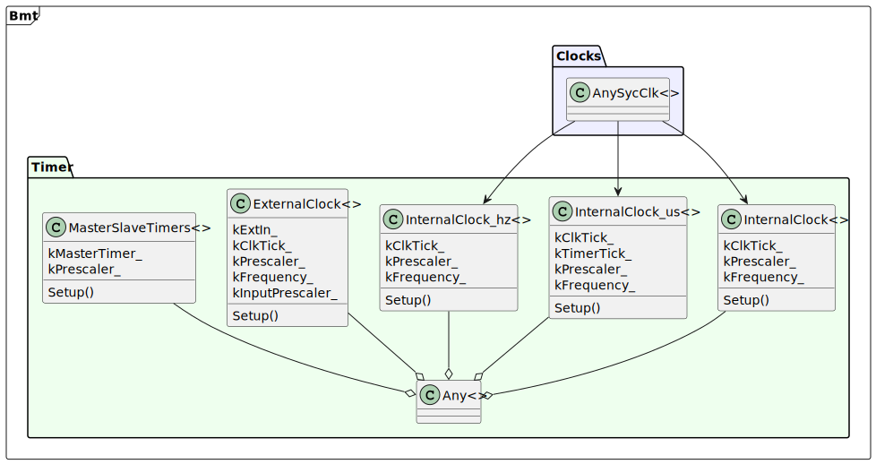

# <big>`Timer` Template Classes</big>

> Operating STM32 timers can be a very complex achievement. Peripherals 
> have too many configuration and documentation does not reveal why some 
> options even exists. Some registers have mutating behavior depending on 
> operating mode, which IMHO is a bad design decision.  
> In general should search for documentation on the web to help you solve 
> specific use cases.

The template classes exposed in **bmt library** covers general use cases. 
It may not cover specific use cases.


# General Library Architecture


<div hidden>
```raw
@startuml timer-classes
namespace Bmt <<Frame>> {
	namespace Clocks #EEEEFF {
		class "AnySycClk<>" as clk
	}
	namespace Timer #EEFFEE {
		class "InternalClock<>" as i_pre
		class "InternalClock_us<>" as i_us
		class "InternalClock_hz<>" as i_hz
		class "ExternalClock<>" as ext
		class "MasterSlaveTimers<>" as ms
		class "Any<>" as any
		class "AnyInputChannel" as ch_in
		class "AnyOutputChannel" as ch_out
	}
}
clk --> i_pre
clk --> i_us
clk --> i_hz
i_pre --o any
i_us --o any
i_hz --o any
ext --o any
ms --o any
any -- ch_in
any -- ch_out
@enduml
```
</div>


# Enumerations With Setup Options

The timer template classes are configured through a set of enumerations. 
In general these maps hardware options as an abstraction layer.

## The `Unit` Enumeration

The unit enumeration contains one identification for each hardware 
implemented timer unit.  
It shows something like this:

```cpp
enum Unit : uintptr_t
{
	kTimInvalid = 0,
#ifdef TIM1_BASE
	kTim1 = TIM1_BASE,		///< Timer 1
#else
	kTim1 = kTimInvalid,
#endif
#ifdef TIM2_BASE
	kTim2 = TIM2_BASE,		///< Timer 2
#else
	kTim2 = kTimInvalid,
#endif

	//...

#ifdef TIM17_BASE
	kTim17 = TIM17_BASE,	///< Timer 17
#else
	kTim17 = kTimInvalid,
#endif
};
```

So, this means that for each specific STM32 family you will have a list 
with values matching your BSP files. The enumeration label associated to 
unsupported timer units are initialized with `Unit::kTimInvalid`.

This type safe value is used to identify a timer inside the 
**bmt library**. 


## The `Channel` Enumeration

The enumeration will look like this:

```cpp
/// The timer channel
enum class Channel
{
	k1			///< Timer Channel 1
	, k2		///< Timer Channel 2
	, k3		///< Timer Channel 3
	, k4		///< Timer Channel 4
};
```

> Note that in newer STM32 hardware up to 6 channels may be used. At the 
> present moment only 4 channels are supported.

This value is used to identify a timer channel.


## The `CaptureEdge` Enumeration

This enumeration controls how an external input senses a digital edge:

```cpp
/// Capture block input control
enum class CaptureEdge
{
	kRising,
	kFalling,
};
```


## The `Mode` Enumeration

This enumeration is used to define the counter behavior for a timer.

```cpp
/// Timer count mode
enum class Mode
{
	kUpCounter,
	kDownCounter,
	kSingleShot,
	kSingleShotDown,
};
```


## The `ExtClk` Enumeration

This enumeration configures the external clock source for a timer.

```cpp
/// External clock source selection
enum class ExtClk
{
	kETR,			///< ETR signal after being prescaled, synchronized then filtered
	kETRN,			///< ETR signal after being prescaled, synchronized then filtered
	kTI1F_ED,		///< The TI1FD signal which sensitive to both signal edges
	kTI1FP1,		///< The TI1FP1 input signal that are the synchronized, filtered TI1
	kTI1FP1N,		///< The negative TI1FP1 input signal
	kTI2FP2,		///< The TI2FP2 input signal that are the synchronized, filtered TI2
	kTI2FP2N,		///< The negative TI2FP2 input signal
};
```


## The `MasterMode` Enumeration

This enumeration configures the master timer mode when connecting two 
timers in a master/slave topology.

```cpp
/// Master timer mode
enum class MasterMode
{
	kUpdate,		///< Sends trigger to slave on every update event
	kEnable,		///< Sends trigger to slave when master is enabled
	kComparePulse,	///< Positive pulse on CC1IF
	kCompare1,		///< OC1REF used as trigger output
	kCompare2,		///< OC1REF used as trigger output
	kCompare3,		///< OC1REF used as trigger output
	kCompare4,		///< OC1REF used as trigger output
};
```


## The `SlaveMode` Enumeration

This enumeration configures the slave timer mode when connecting two 
timers in a master/slave topology.

```cpp
/// Slave timer mode
enum class SlaveMode
{
	kMasterIsClock,	///< Triggers from master are used to generate clock
	kResetCnt,		///< Trigger from master clears the slave counter
	kGatedMode,		///< High triggers from master enables/gates the slave counter clock
	kStartMode,		///< Counter start when master triggers. Only start is controlled
};
```


## The `InputCapture` Enumeration

This enumeration configures a channel input. Please check data-sheet 
documentation for details.

```cpp
/// Timer input for capturing
enum class InputCapture
{
	kTI1FP1,	///< TI1FP1 clock input
	kTI1FP2,	///< TI1FP2 clock input
	kTI2FP1,	///< TI2FP1 clock input
	kTI2FP2,	///< TI2FP2 clock input
	kTI3FP3,	///< TI3FP3 clock input
	kTI3FP4,	///< TI3FP4 clock input
	kTI4FP3,	///< TI4FP3 clock input
	kTI4FP4,	///< TI4FP4 clock input
	kTRC,		///< TRC clock input
};
```


## The `OutMode` Enumeration

This enumeration controls the behavior of an output channel when the 
compare register matches the timer counter.

```cpp
enum class OutMode
{
	kFrozen = 0
	, kSetActive
	, kSetInactive
	, kToggle
	, kForceInactive
	, kForceActive
	, kPWM1
	, kPWM2
};
```


## The `Output` Enumeration

This enumeration configures if a channel output should be disabled, 
enabled or inverted:

```cpp
enum class Output
{
	kDisabled
	, kEnabled
	, kInverted
};
```

# Timer Clock Source

In general a timer can be clocked through a set of different sources. 
like the figure below:



<div hidden>
```raw
@startuml timer-source
namespace Bmt <<Frame>> {
	namespace Clocks #EEEEFF {
		class "AnySycClk<>" as clk
	}
	namespace Timer #EEFFEE {
		class "InternalClock<>" as i_pre {
			kClkTick_
			kPrescaler_
			kFrequency_
			Setup()
		}
		class "InternalClock_us<>" as i_us {
			kClkTick_
			kTimerTick_
			kPrescaler_
			kFrequency_
			Setup()
		}
		class "InternalClock_hz<>" as i_hz {
			kClkTick_
			kPrescaler_
			kFrequency_
			Setup()
		}
		class "ExternalClock<>" as ext {
			kExtIn_
			kClkTick_
			kPrescaler_
			kFrequency_
			kInputPrescaler_
			Setup()
		}
		class "MasterSlaveTimers<>" as ms {
			kMasterTimer_
			kPrescaler_
			Setup()
		}
		class "Any<>" as any
	}
}
clk --> i_pre
clk --> i_us
clk --> i_hz
i_pre --o any
i_us --o any
i_hz --o any
ext --o any
ms --o any
@enduml
```
</div>

The picture shows that you have five options to configure the input clock 
of a timer. Three of them are just different perspective of the system 
clock.


## The `InternalClock<>` Clock Source

This class uses the internal timer clock to drive the timer.


<div hidden>
```raw
@startuml timer-internal-clock
namespace Bmt <<Frame>> {
	namespace Clocks #EEEEFF {
		class "AnySycClk<>" as clk
	}
	namespace Timer #EEFFEE {
		enum Unit {
			kTim1
			kTim2
			kTim3
			kTim4
		}
		circle "Prescaler" as pre
		class "InternalClock<>" as i_pre {
			{static} kClkTick_
			{static} kPrescaler_
			{static} kFrequency_
			Setup()
		}
		class "Any<>" as any
	}
}
clk --> i_pre
pre --> i_pre
Unit --o i_pre
i_pre --o any
hide clk members
hide Unit methods
hide any members
@enduml
```
</div>

This clock source allows one to specify manually a prescaler value. The 
simplified template class declaration follows:

```cpp
//! Template to adjust timer prescaler to register counts
template <
	const Unit kTimerNum
	, typename SysClk
	, const uint32_t kPrescaler = 0U	// max speed
>
class InternalClock : public AnyTimer_<kTimerNum>
{
	//...
}
```

A typical use case on a BluePill STM32F103 would be:

```cpp
// A data-type for the 8 MHz HSE clock
typedef Clocks::AnyHse<> Hse;			// BluePill has a 8MHz XTAL
// A data-type for the clock tree
typedef Clocks::AnySycClk<Hse> SysClk;	// uses HSE for the clock tree

// Computes the prescaler for 1 kHz counter speed (8MHz / 8000)
typedef InternalClock <kTim1, SysClk, 8000UL-1UL> Millisec;
// Timer that overflows every 5 ms (200Hz) [note: count is 0-base]
typedef Timer::Any<Millisec, Mode::kUpCounter, 5UL-1UL> FiveMs;
```

In words:
- The `Hse` data-type represent the 8MHz crystal tied to the **HSE** 
input. 
- The `SysClk` data-type represents the internal clock-tree of the STM32, 
including AHB, HCLK, APB1 and APB2.
- The `Millisec` data-type is used to configure the internal clock for 
the **TIM1** using a prescaler of 4999 units, which divides the 8MHz 
timer clock by 8000, producing a 1 kHz timer frequency.
- Finally, the `FiveMs` data-type represents the **TIM1** timer hardware. 
Here it receives clock specified by `Millisec` data-type, working as an 
**up-counter** and overflowing after 5 clock pulses. This produces a 
200 Hz period.

> Note that this example either specify a timer input nor an output, 
> keeping the example simple. Though update events for the timer are 
> active and could be used as an interrupt source or other possibilities. 


## The `InternalClock_us<>` Clock Source

This class uses the internal timer clock to drive the timer and allows 
the developer to specify a clock period in microseconds. 


<div hidden>
```raw
@startuml timer-internal-clock-us
namespace Bmt <<Frame>> {
	namespace Clocks #EEEEFF {
		class "AnySycClk<>" as clk
	}
	namespace Timer #EEFFEE {
		enum Unit {
			kTim1
			kTim2
			kTim3
			kTim4
		}
		circle "Period (us)" as pre
		class "InternalClock<>" as i_pre {
			{static} kClkTick_
			{static} kTimerTick_
			{static} kPrescaler_
			{static} kFrequency_
			Setup()
		}
		class "Any<>" as any
	}
}
clk --> i_pre
pre --> i_pre
Unit --o i_pre
i_pre --o any
hide clk members
hide Unit methods
hide any members
@enduml
```
</div>

This clock source allows you to specify a period in microsecond for the 
timer clock.  The simplified template class declaration follows:

```cpp
//! Template to adjust timer prescaler to us
template <
	const Unit kTimerNum
	, typename SysClk
	, const uint32_t kMicroSecs = 1000U
>
class InternalClock_us : public AnyTimer_<kTimerNum>
{
	//...
}
```

For example, if we want to produce a timer clock frequency of 1 kHz, we 
modify the previous example like the code below:

```cpp
// A data-type for the 8 MHz HSE clock
typedef Clocks::AnyHse<> Hse;			// BluePill has a 8MHz XTAL
// A data-type for the clock tree
typedef Clocks::AnySycClk<Hse> SysClk;	// uses HSE for the clock tree

// Computes the prescaler for 1000 µS (1 kHz) counter speed 
typedef InternalClock_us <kTim1, SysClk, 1000UL> Millisec;
// Timer that overflows every 5 ms (200Hz) [note: count is 0-base]
typedef Timer::Any<Millisec, Mode::kUpCounter, 5UL-1UL> FiveMs;
```

> This example produces effectively the same clock frequency on a typical 
> Blue-Pill board. But it produces portable code, since it will keep the 
> target frequency independently of the clock tree configuration. Moving 
> the code to another hardware platform tends to work by just 
> recompiling, while the first example will require manually fixing of 
> the prescaler value.


## The `InternalClock_Hz<>` Clock Source

This class uses the internal timer clock to drive the timer and allows 
the developer to specify a clock frequency in Hertz. 


<div hidden>
```raw
@startuml timer-internal-clock-hz
namespace Bmt <<Frame>> {
	namespace Clocks #EEEEFF {
		class "AnySycClk<>" as clk
	}
	namespace Timer #EEFFEE {
		enum Unit {
			kTim1
			kTim2
			kTim3
			kTim4
		}
		circle "Period (Hz)" as pre
		class "InternalClock<>" as i_pre {
			{static} kFrequency_
			{static} kClkTick_
			{static} kPrescaler_
			Setup()
		}
		class "Any<>" as any
	}
}
clk --> i_pre
pre --> i_pre
Unit --o i_pre
i_pre --o any
hide clk members
hide Unit methods
hide any members
@enduml
```
</div>

This clock source allows you to specify a frequency for the timer clock 
in Hz.  The simplified template class declaration follows:

```cpp
//! Template to adjust timer prescaler to Hz
template <
	const Unit kTimerNum
	, typename SysClk
	, const uint32_t kMHz = 1000000
>
class InternalClock_Hz : public AnyTimer_<kTimerNum>
{
	//...
};
```

For example, using the same requirement of the previous example, to 
obtain 1 kHz it is not necessary to compute the period (1 µs). Just 
providing the units in Hertz will be enough.
So the example would look like this:

```cpp
// A data-type for the 8 MHz HSE clock
typedef Clocks::AnyHse<> Hse;			// BluePill has a 8MHz XTAL
// A data-type for the clock tree
typedef Clocks::AnySycClk<Hse> SysClk;	// uses HSE for the clock tree

// Computes the prescaler for 1000 Hz (1 us) counter speed 
typedef InternalClock_Hz <kTim1, SysClk, 1000UL> OneKHz;
// Timer that overflows every 5 ms (200Hz) [note: count is 0-base]
typedef Timer::Any<OneKHz, Mode::kUpCounter, 5UL-1UL> FiveMs;
```

> This example shows another perspective for the solution. For a very 
> trivial case like the one used in this example, it almost does not 
> matter the way we solve, but project specifications will vary a lot and 
> you may profit from this flexibility. 

Note that all three option presented here computes a static constant 
called `kFrequency_`, which exposes the resulting frequency of the 
clock source. You are encouraged to refer to it whenever you want to 
ensure that your code is portable. Think of these constants as the same 
`#define xxx` of a C code, but with the type safety provided by the 
language.


## The `ExternalClock<>` Clock Source

The `ExternalClock<>` clock source exposes a complex circuit present on 
most STM32 timer units, which allows you to externally feed a clock 
signal into a timer unit.


<div hidden>
```raw
@startuml timer-external-clock
namespace Bmt <<Frame>> {
	namespace Timer #EEFFEE {
		circle "Filter" as filt
		circle "Prescaler" as pre
		circle "Period (Hz)" as freq
		enum ExtIn {
			kETR
			kETRN
			kTI1F_ED
			kTI1FP1
			kTI1FP1N
			kTI2FP2
			kTI2FP2N
		}
		enum Unit {
			kTim1
			kTim2
			kTim3
			kTim4
		}
		class "ExternalClock<>" as i_pre {
			{static} kExtIn_
			{static} kFrequency_
			{static} kPrescaler_
			{static} kInputPrescaler_
			Setup()
		}
		class "Any<>" as any
	}
}
ExtIn --o i_pre
Unit --o i_pre
pre --> i_pre
freq --> i_pre
filt --> i_pre
i_pre --o any
hide ExtIn methods
hide Unit methods
hide any members
@enduml
```
</div>

The external clock is not a trivial circuit, since it has a complex set 
of options and configurations, which are implemented on hardware and 
documented on data-sheet and other papers. 

```cpp
template <
	const Unit kTimerNum
	, const ExtClk kExtIn
	, const uint32_t kFreq = 1000000	// this value has no effect
	, const uint32_t kPrescaler = 0		// Value for PSC register
	, const uint32_t kFilter = 0		// a value between 0 and 15 (see docs)
	, const uint32_t kEtrPrescaler = 1	// ETR max frequency is 1/4 of timer clock.
>
class ExternalClock : public AnyTimer_<kTimerNum>
{
	//...
}
```


### Template Parameters

The template parameters are used to fine tune the external clock 
configuration:
- **`kTimerNum`**: Specifies the timer unit to be used
- **`kExtIn`**: Specifies the input path of the external clock. The 
possible inputs are **ETR**, **CH1** and **CH2**. Polarity of the signal 
can also be selected with this enumeration.
- **`kFreq`**: This argument specifies the frequency of the external 
clock, which depends on your hardware implementation.  
This argument is not used internally, but it is propagated through the 
**`kFrequency_`** static member, which could be used by the developer 
when glueing this data type with others, facilitating cooperation between 
software parts.
- **`kPrescaler`**: This parameter programs the timer prescaler, which 
divides the clock frequency. ote that this value is 0-based, which means 
that 0 divides by 1, a value of 1 divides by 2 and so on. This prescaler 
is common to all clock sources.
- **`kFilter`**: This parameter allows you to reduce noise caused by the 
clock input line. You specify a value between 0 (off) and 15, which 
indicates the amount of bus clock cycles (APB1 or APB2, depending on the 
timer unit) to be sampled to recognize a state change on the input line, 
filtering out transition noise in the external clock. This causes a delay 
between the input edge and the final clock edge.
- **`kEtrPrescaler`**: This parameter programs the **ETR** input 
prescaler. The hardware requires that the maximal **ETR** clock is 
**1/4** of the timer bus frequency. Through this parameter you can divide 
the input frequency by **1**, **2**, **4** or **8**, before it enters the 
counter circuit. 


### External Clock Input Signal (`kExtIn`)

The following diagram shows the structure of the timer hardware at the 
perspective of the external clock:


<div hidden>
```raw
@startuml external-clock-logic
together {
	circle "ETR" as etr
	rectangle etrp [
		Polarity Selection:
		<b>kETR:</b> Rising edge
		<b>kETRN:</b> Falling edge
	]
	rectangle etrpp [
		Prescaler
	]
	rectangle etrf [
		Filter
	]
}
together {
	circle "TIMx_CH1" as ch1
	rectangle ch1p [
		Polarity Selection:
		<b>kTI1F_ED:</b> Both edges
		<b>kTI1FP1:</b> Rising edge
		<b>kTI1FP1N:</b> Falling edge
	]
	rectangle ch1f [
		Filter
	]
	rectangle tim [
		Timer Block
		----
		Prescaler
		Counter
		Capture/Compare
	]
}
together {
	circle "TIMx_CH2" as ch2
	rectangle ch2p [
		Polarity Selection:
		<b>kTI2FP1:</b> Rising edge
		<b>kTI2FP1N:</b> Falling edge
	]
	rectangle ch2f [
		Filter
	]
}
etr -> etrp
etrp -> etrpp
etrpp -> etrf
ch1 -> ch1p
ch1p -> ch1f
ch2 -> ch2p
ch2p -> ch2f
etrf --> tim
ch1f -> tim
ch2f --> tim
etr -[hidden]-> ch1
ch1 -[hidden]-> ch2
@enduml
```
</div>

> Please note that only the **ETR** input allows to specify a prescaler 
> for the input clock. This prescaler works independently of the timer 
> prescaler. Use this prescaler if the frequency of the ETR signal is 
> more than **1/4** of the timer bus clock value.
>
> Note that **CH1** is the only input that allows counting for each input 
> edge, which will double the frequency.


### Simple Use Case

Below follows an example for **Timer 1** using **input 1** as clock source:

```cpp
typedef Timer::ExternalClock<
	kTim1						// Timer 1
	, Timer::ExtClk::kTI1FP1;	// Timer Input 1 (PA8)
	, 562500					// 562.5 khz
	, 1							// no prescaler
	, 0							// fastest input filter
> Clk1;
// A timer counting up to 100
typedef Timer::Any<Clk1, Mode::kUpCounter, 100> MyTimer;
```


## The `MasterSlaveTimers<>` Clock Source


# Timer Device (`Any<>`)


